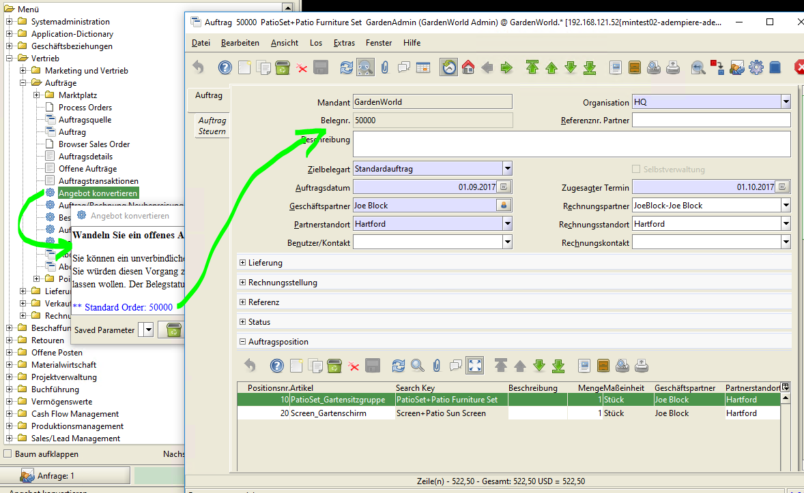
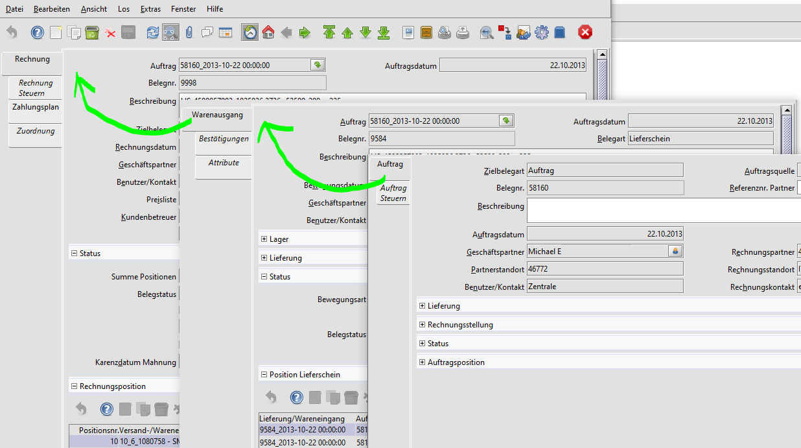
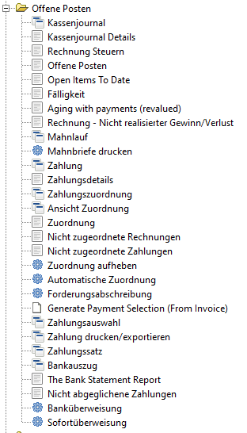

# Vertriebsprozess

Der Vertreibsprozess beginnt nicht immer mit einem Auftrag. Die Auftraggeber müssen erst gewonnen werden. Oft ist dem Auftrag ein Angebot vorangestellt.

In Adempiere spiegelt sich der Sachverhalt im Menüpunkt "Marketing und Vertrieb". Ein Angebot wird ähnlich wie ein Auftrag erstellt und befindet sich daher im Menü "Aufträge"

## Angebotserstellung

Beispiel: Sie erfassen ein "Angebot" an einen Geschäftspartner über die Lieferung einer Gartensitzgruppe samt Sonnenschirm:

## Auftragsannahme

Akzeptiert der Kunde das Angebot, so können Sie das "Angebot" in einen "Auftrag" umwandeln. Damit entfällt eine wiederholte Erfassung. Der Auftrag kann vor der Fertigstellung modifiziert werden:

Im Beispiel ist die Lieferadresse gleich der Rechnungsadresse.

## Lieferung

Aus dem Auftrag kann der Lieferschein für den Warenausgang und die Rechnung generiert werden. Nicht immer ist die Lieferadresse gleich der Rechnungsadresse. Geliefert wird an den Geschäftspartner "Michael E.", die Rechnung geht an den Rechnungspartner.

Für die Belege können verschiedene Nummernkreise definiert werden.

## Rechnungsstellung

Das Drucken von Angeboten, Aufträgen, Lieferscheinen und Rechnungen ist einheitlich. Aus der Rechnungsvorschau wird ein PDF erstellt, das gedruckt oder per Mail verschickt werden kann. Per Zoom-Across kann aus der Rechnung der zugehörige Lieferschein und der Auftrag gefunden werden.

## Zahlungsverfolgung

Die Zahlungsverfolgung ist im Menu unter "Offene Posten" untergebracht. Dort können Eingangszahlungen erfaßt und den Rechnungen zugeordnet werden werden.

