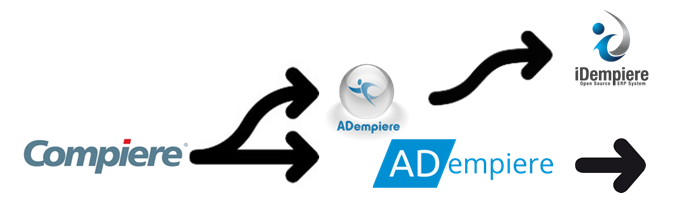

# Introduction

## A de-mpiere

[Ade-mpiere](https://github.com/klst-de/adempiere) is a [fork](https://en.wikipedia.org/wiki/Fork_%28software_development%29) of [adempiere](https://github.com/adempiere/adempiere)-repo, one of the children of [Compiere ERP system](https://en.wikipedia.org/wiki/Compiere) which was developed in the late 90th

## [History](https://en.wikipedia.org/wiki/IDempiere#History)

* [ADempiere.io \(en\)](https://www.adempiere.io/) : is \*.net or \*.io the official\(!\) successor of Compiere? [Documentation \(en\)](https://adempiere.gitbook.io/docs/)
* [ADempiere.org \(en\)](http://adempiere.org/site/) : or is this the official\(!\) page of the successor of [Compiere-ERP](https://www.aptean.com/de-DE/solutions/erp/products/aptean-compiere-erp)?
* [IDempiere](https://en.wikipedia.org/wiki/IDempiere) : [iDempiere](http://www.idempiere.org/) is a grandchild of [Compiere](http://www.compiere.com/svn/)

