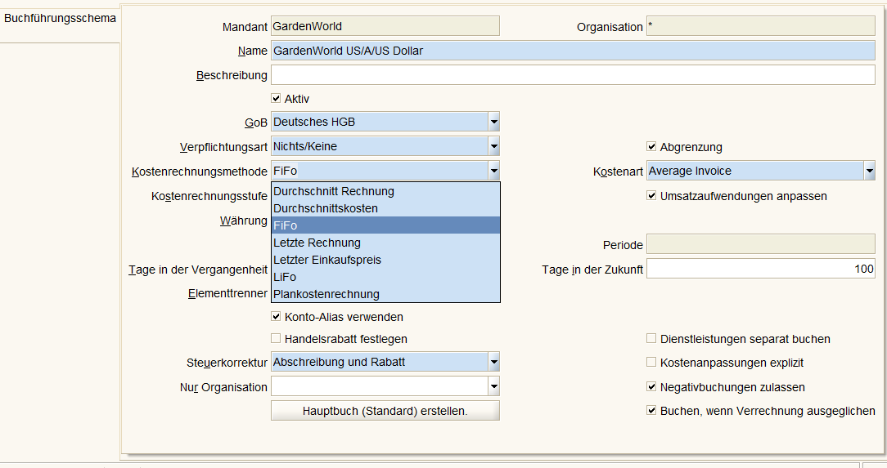

## Buchführungsschema 

Beim Einstellen der Buchführung werden diverse Regeln festgelegt 
* GAAP / GoB 
* Commitment Type / Verpflichtungsart, z.B. Reservierung von Ware beim Auftragseingang
* mit Accrual / [Periodenabgrenzung](http://www.wirtschaftslexikon24.com/d/accrual-principle/accrual-principle.htm) wird festgelegt, welcher Periode Erträge bzw. Aufwände zugeordnet werden  
* das Kostenrechnungsverfahren bestimmt die Bwertung vom Vorratsvermögen

* siehe auch [Fenster Buchführungsschema in idempiere](http://wiki.idempiere.org/de/Buchf%C3%BChrungsschema_%28Fenster_ID-125%29)

 

### Bwertung vom Vorratsvermögen

Es gibt verschiedene Bewertungsmethoden. Grundsätzlich gilt für der Bwertung vom Vorratsvermögen das Prinzip der Einzelbewertung. Ein Warenlager kann also nicht als Ganzes bewertet werden. Natürlich kann nicht jedes einzelne Güterstück im Lager separat bewertet werden. Gruppen-. Sammel oder Festwerbewrtung sind daher zulässig. Dazu gibt es mehrere Verfahren.

* in der Durchnittswertmethode (Averaging) werden die durchschnittlichen Anschaffungskosten der Ware zugrundegelegt 
* die Verbrauchfolgeverfahren
  * FiFo : Ware, die zuerst eingekauft wird, wird zuerst verbraucht
  * LiFo : Ware, die zuletzt eingekauft wird, wird zuerst verbraucht
  * Hifo : Ware mit dem höhsten Wert wir zuerst verbraucht (diese Methode ist in der Praxis der Finanzverwaltungen oft nicht zulässig)

Einen Vergleich der Methoden Averaging, FiFo und LiFo befindet sich [hier (en)comparing-inventory-valuation-methods](https://www.dummies.com/business/operations-management/comparing-inventory-valuation-methods-for-a-business/)