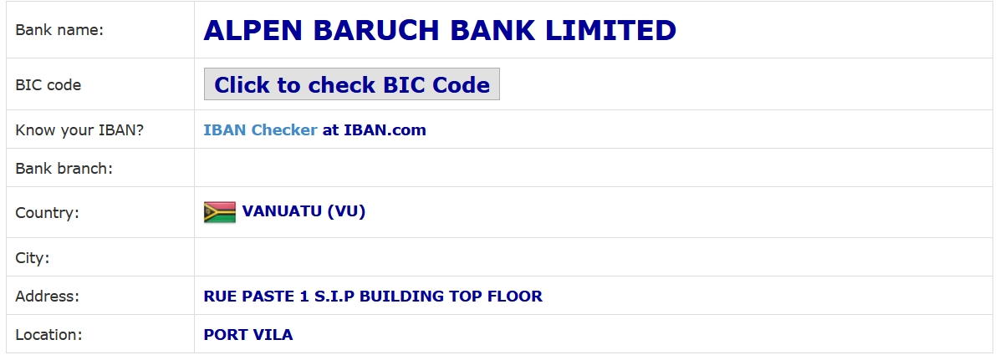

## Banken

Das Thema hat mehrere Aspekte
* iban - siehe https://www.ecbs.org/iban.htm
* swiftbic - siehe https://www.swiftbic.com/what-is-bic-code.html

### IBAN

Die International Bank Account Number, kurz [IBAN](https://www.iban.de/index.html) genannt, ist eine international standardisierte Nummer, welche jedes Girokonto eindeutig bezeichnet.

Die IBAN ist zwar eine europäische Erfindung, wird aber in [viele Länder](https://de.wikipedia.org/wiki/Internationale_Bankkontonummer) außerhalb Europas exportiert.

Beispiele: 

* `GB33 BUKB 2020 1555 5555 55`
* `DE75 5121 0800 1245 1261 99` 
* `FR76 3000 6000 0112 3456 7890 189` 
* `SV62 CENR 0000 0000 0000 0070 0025`

#### IBAN Validierung

siehe 
* [commons.apache.org doc](https://commons.apache.org/proper/commons-validator/apidocs/org/apache/commons/validator/routines/IBANValidator.html)
* https://github.com/apache/commons-validator
* [adempiere/pull/2455](https://github.com/adempiere/adempiere/pull/2455) - add IBAN to `c_bp_bankaccount`

### SWIFT-BIC

Zur Identifizierung eines Kreditinstitutes wird der SWIFT-Code verwendet, auch als internationale Bankleitzahl (BIC - Bank Identification Code) bezeichnet. Innerhalb des Europäischen Zahlungsraums, der [SEPA/Single Euro Payments Area](https://de.wikipedia.org/wiki/Europ%C3%A4ischer_Zahlungsraum), wird die BIC nicht benötigt.

Das European Committee for Banking Standards [ECBS](https://www.ecbs.org/iban.htm) listet für die Mitgliedsländer den Aufbau der IBAN und die registrierten Bankan und deren BIC auf. Beispiele:

* in [Andorra gibt es 5 Banken](https://www.ecbs.org/banks/andorra/)
* [Banken in UK](https://www.ecbs.org/banks/united-kingdom/)

Unter [swiftbic.com](https://www.swiftbic.com/index.html) kann man zu allen Ländern die Bankdaten bekommen. Leider nicht die BIC. Da wird man auf den kostenpfilchtigen Dienst von iban.com verwiesen. Alternativen sind die (möglicherweise dubiosen) Seiten [bank-code.net](https://bank-code.net/country/starts-with-letter-V) oder [currencyaz.com](https://currencyaz.com/swift-code/country/starts-with-letter-v). Dort werden die SWIFT-Codes angezeigt.
Beispiel:

* V: [List of Banks in VANUATU](https://www.swiftbic.com/banks-in-VANUATU.html)

  

### IBAN und BIC

Direkt aus der IBAN läßt sich die BIC nicht ermitteln. Beispiele:

* [DE69 50310400 0000696969](https://www.iban.de/banks/barclays) und BIC BARCDEFFXXX (Barclays)
* [DE84 50010900 0000123123](https://www.iban.de/banks/bank-of-america) und BIC BOFADEFXXX (Bank of America)
* [DE14 20050550 0000123456](https://www.iban.de/banks/haspa) und BIC HASPDEHHXXX (Hamburger Sparkasse)
* [DE77 10033300 0000987654](https://www.iban.de/banks/santander) und BIC SCFBDE33 (Santander, Berlin)
* [DE21 20300000 0000202051](https://www.iban.de/banks/postbank) und BIC PBNKDEFFXXX (Postbank)

In der de-IBAN steckt die "alte" Bankleitzahl (bank identifier, routing number), in gb/uk-IBAN sind es die `UK Sort Codes`. Die Ermittlung der zugehörigen BIC ist daher von Land zu Land anders. Der Weg führt über die nationale `bank identifier`. [iban.com](https://www.iban.com/register) hat dafür einen teueren Web Service [IBAN Validation](https://www.iban.com/validation-api).

Bei einigen Nationalbanken läßt sich eine Liste der aktuell registrieten Banken runterladen, z.B. (de)Bundesbank, (at)Nationalbank, (be)Nationalbank. 

### Abkürzungen

Abkürzung  | Bedeutung
---------- | ---------------
ESZB       | Europäisches System der Zentralbanken
EZB        | Europäische Zentralbank
LEI        | Legal entity identifier
MFI        | Monetäres Finanzinstitut
RIAD       | Register of Institutions and Affiliates Data, listet ca 5000 Institute auf und zeigt deren Abhängigleiten. Beispiel SEZDDEF1XXX ist Tochterbank von SABRATWWXXX

