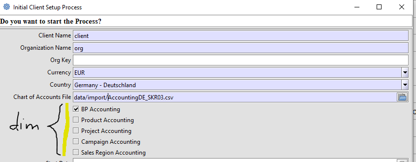
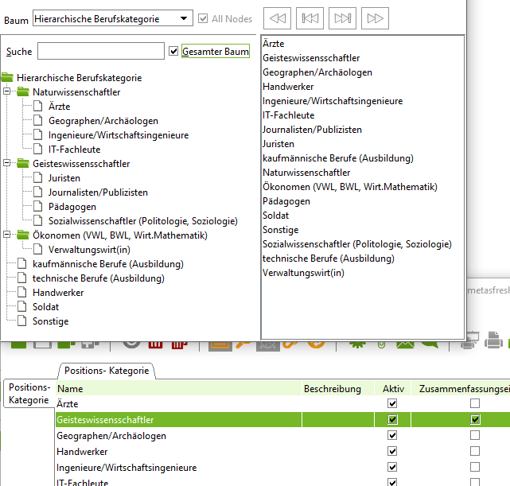
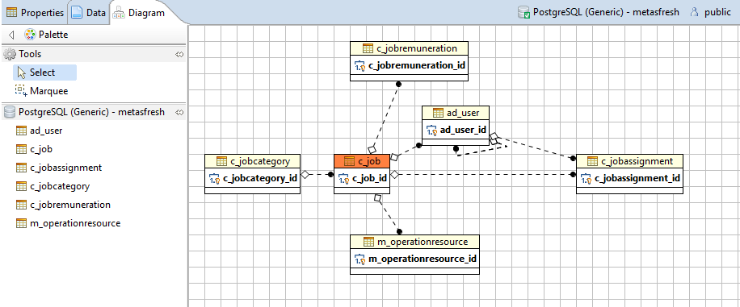

# Installation

* nach der [Installation (en)](http://wiki.adempiere.net/Installation_Steps) von ADempiere V.3.9.0 stellt man fest, dass die Basissprache  `en` ist und die einzige Übersetzungssprache `es_MX` ist - kein Wunder, dort sitzt [der Hauptentwickler](https://github.com/e-Evolution).  

## [Anpassung der Übersetzungssprache](http://wiki.idempiere.org/de/Sprache_%28Fenster_ID-106%29#Beitr.C3.A4ge)

Wer die Anpassung `mx` nach `de` nicht selber machen will, findet eine Dump für Postgresql [hier](https://github.com/klst-de/de-mpiere/tree/master/data/seed)

im login-Fenster werden immer noch alle Sprachen angezeigt!

* deaktiveren aller nicht benötigten Sprachen per SQL:

```sql
update ad_language set isactive='N'
where not(isbaselanguage='Y' or issystemlanguage='Y')
```

* ...  hilft nicht viel, denn
* in `org.compiere.util.Language` sind die im login-Fenster angezeigten Sprachen statisch definiert

## Einrichtung eines Mandanten mit Standard-Kontenrahmen



Gesetzlich besteht kein [Zwang für die Anwendung eines Kontorahmens](http://wirtschaftslexikon.gabler.de/Archiv/6469/erlasskontenrahmen-v8.html). De facto haben sich [Standardkontenrahmen](https://de.wikipedia.org/wiki/Kontenrahmen#Standardkontenrahmen) als Muster für einen [Kontenplan](https://de.wikipedia.org/wiki/Kontenplan) durchgesetzt

* [Kontenplan](http://wiki.idempiere.org/de/Ersteinrichtung_Mandant#Hinweise_zu_Kontenpl.C3.A4nen)

Beim Einrichten werden die optionalen [Dimensionen für die Buchführung](2.8-acc.md) festgelegt.

## Belegarten

### Basisbelegart

alle Belege (Aufträge, Lieferscheine, Rechnungen) werden von wenigen Basisbelegarten (DocBaseType, 3-stellig, z.B. ARI) abgeleitet. Es gibt auch einige 2-stellige Unterarten (DocSubType) für POO und SOO. So werden Angebote OB/Bindig/verbindlich bzw. ON/Non-bindig/unverbindlich als Unterarten von SOO/Auftrag abgelegt:

docbasetype | (en)                          | (de)
----------- | ----------------------------- | ----
APC         | Account Payable Creditmemo    | Gutschrift (vom Lieferanten)
API         | Account Payable Invoice       | Eingangsrechnung (vom Lieferanten)
APP         | Account Payable Payment       | Zahlung an Lieferanten 
ARC         | Account Receivable Creditmemo | Kundengutschrift
ARF         | AR Pro Forma Invoice          | [Proformarechnung](https://de.wikipedia.org/wiki/Proformarechnung)
ARI         | Account Receivable Invoice    | Ausgangsrechnung (an Kunden) 
ARR         | Account Receivable Receipt    | Eingangszahlung
CMA         | Payment Allocation            | 
CMB         | Bank Statement                | Benküberweisung 
CMC         | Cash Journal                  | Kassenbuch
DOO         | Distribution Order            |  
FAA         | Fixed Assets Addition         |
FAD         | Fixed Assets Depreciation     |   
FDP         | Fixed Assets Disposal         | 
GLD         | [General Ledger](https://en.wikipedia.org/wiki/General_ledger) Document | Hauptbuch Buchungsbeleg   
GLJ         | General Ledger Journal        |
HRP         | Payroll                       | Gehalt 
MCC         | Manufacturing Cost Collector  | 
MMI         | Material Physical Inventory   |   
MMM         | Material Movement             | Bestandsbewegung  
MMP         | Material Production           | 
MMR         | Material Movement Receipt     | Wareneingangsbeleg  
MMS         | Material Movement Shipment    | Warenausgangsbeleg, Lieferschein
MOF         | Maintenance Order             | Wartungsauftrag 
MOP         | Manufacturing Order           |  
MPO         | Manufacturing Planned Order   | 
MQO         | Quality Order                 | 
MXI         | Match Invoice                 | [Rechnungsabgleich](https://www.controlling-wiki.com/de/index.php/Invoice_Matching_%28Rechnungsabgleich%29)
MXP         | Match Purchase Order          |   
PJI         | ProJect Issue                 |  
POO         | Purchase Order Order          | Bestellung (mit einer Unterart)   
POR         | Purchase (Order) Requisition  | Anforderung an die Bestellung/Bedarfsmeldung
SOC         | Sales (Order) Commission      | Verkaufsprovision  
SOO         | Sales Order Order             | (Kunden-) Auftrag (mit mehreren Unterarten) 


## Steuern 

Das [Datenmodell](https://globalqss.com/idempiere/5.1_20171111/schemaspy/Tax/relationships.html) für Steuern ist komplex. Allein die UN/EDIFACT [Liste der Steuerkategorien](http://www.unece.org/trade/untdid/d13b/tred/tred5153.htm) ist recht umfangreich. Für den Anfang sollte man die diversen USt der Kategorie VAT/"Value added tax" mit ihren [Steuersätzen](https://de.wikipedia.org/wiki/Umsatzsteuer#Umsatzsteuer_in_EU-L.C3.A4ndern) anlegen.

## TODO : [Maßeinheiten](http://wiki.idempiere.org/de/Ma%C3%9Feinheit_%28Fenster_ID-120%29)

## [Ortsangaben](https://bitbucket.org/eugenh/idempiere/wiki/Orte#!landerspezifische-einstellungen) 

Geografische (?) Begriffe werden durch drei Entitäten [modelliert](https://bitbucket.org/eugenh/idempiere/wiki/Orte#!datenmodell) und in einem Fenster mit drei Reitern verwaltet: [Land, Region, Ort](http://wiki.idempiere.org/de/Land,_Region,_Ort_%28Fenster_ID-122%29).

Länder und Regionen sind durchaus keine geografischen Begriffe, sondern ehe politische. Sie unterliegen ständigen Veränderungen, siehe [Verzeichnis der Länder, Gebiete und Währungen](http://publications.europa.eu/code/de/de-5000500.htm). In ADempiere sind [247 Landobjekte](https://bitbucket.org/eugenh/idempiere/wiki/Orte#!lander) definiert. Zu `countrycode` siehe [ISO 3166](https://www.iso.org/obp/ui/#iso:pub:PUB500001:en).

## Banken

Bankdaten, Tabelle `c_bank` sind Referenzdaten, wie Länder, Sprachen oder Maßeinheiten. Referenzdaten sind mandantenübergreifend und sollten daher vom Mandatnen `system` allen anderen Mandanten bereitgestellt werden. In ADempiere ist es nicht der Fall. In `system` werden keine Bankdaten bereitgestellt. Die Konsequenz: in einem ADempieresystem mit zwei Mandanten muss jeder Mandant die Bankdaten redundant pflegen. Laut Bundesbank sind in Deutschland ca 16 Tausend Banken registriert. Es ist nicht sinnvoll, dass beide Mandanten die Bankdaten separat pflegen. Wohlgemerkt: es handelt sich nicht um Kontodaten, sondern um Daten der Kreditinstitute, also BIC, Adressen und Namen der Banken.

* siehe [adempiere Bank](http://wiki.adempiere.net/DE/Bank#Beitr.C3.A4ge) - die Bundesbank stellt aktualisierte Bankdaten bereit
* mit einem `bank importer`-Programm lassen sich die Bundesbankdaten in ADempiere `c_bank` überführen

## Vertiebsgebiet

siehe [Aufteilung in Nielsengebiete](http://wiki.idempiere.org/de/Baum_%28Fenster_ID-163%29#SalesRegion)

## Berufskategorie

Bei der Systeminstallation sollte man die Referenztabellen `c_job` und `c_jobcategory` befüllen. Die Tabelle `c_jobcategory` läßt sich relativ einfach so erweitern, dass eine hierarchische Berufskategorie als Baum definiert werden kann. Etwa so:



Die Daten für jobcategory gibt als ISCO-88 Standard in drei Sprachen von der Internationalen Arbeitsorganisation (ILO), siehe [hier](http://wiki.idempiere.org/de/Positionskategorie_%28Fenster_ID-352%29#Berufskategorien).

Die Einordnung von job und jobcategory in das [Datenmodell/link](https://globalqss.com/idempiere/1.0c/schemaspy/OrgUser/relationships.html):



