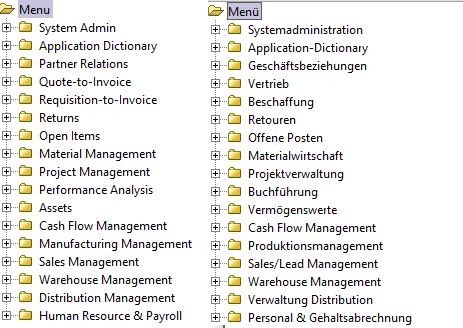

# Übersetzung

Die Basissprache ist `en`.  Nicht alles ist übersetzt. Manchmal ist die Übersetzung nicht korrekt, fehlerhaft oder irreführend. Als Administrator kannst Du fast alles korrigieren.

## Was wird übersetzt?

* fast alles was sinnvoll ist

Es ist i.A. nicht sinnvoll, Stamm- oder Bewegungsdaten zu übersetzten. Der Kunde "Müller" heißt auch in spanisch "Müller".
Allerdings gibt es Stammdaten, die in einer international ausgerichteten Firma, durchaus übersetzt werden können. 
Ein Autozulieferer wird für seine Produktpalette die Artikelbeschreibungen mehrsprachig halten: in `m_product` die international gängingen Bezeichnungen. Und in `m_product_trl` die jeweiligen Übersetzungen. 

Die meisten Übersetzungen betreffen aber das UI, die ADempiere-Benutzeroberfläche, also die Menübeschriftungen:

* alle Fensterelemente, Felder, Fehler- und sonstige Meldungen, usw.
* diese Informationen sind in Metatabellen abgelegt (meist beginnen sie mit `AD_`)

## Wo wird übersetzt?

* mittels ADempiere selber

## Übersetzungstabellen

Die Tabellen die mit `_trl` enden sind Übersetzungstabellen. Es gibt ca 40 davon.

### Tabellenarten

#### Metatabellen

* `ad_element_trl` 
* `ad_field_trl` 
* `ad_fieldgroup_trl` 
* `ad_form_trl` 
* `ad_index_table_trl` 
* `ad_infocolumn_trl` 
* `ad_infowindow_trl` 
* `ad_menu_trl` 
* `ad_message_trl` 
* `ad_printformatitem_trl` 
* `ad_process_para_trl` 
* `ad_process_trl` 
* `ad_ref_list_trl` 
* `ad_reference_trl` 
* `ad_tab_trl` 
* `ad_table_trl` 
* `ad_task_trl` 
* `ad_wf_node_trl` 
* `ad_window_trl` 
* `ad_workbench_trl` 
* `ad_workflow_trl` 

#### Referenztabellen

Bei diesen Tabellen ist es nicht sinnvoll, dass jeder Mandant eine eigene Übersetzung hat.

* `c_charge_trl` - Gebühren 
* `c_country_trl` 
* `c_currency_trl` 
* `c_doctype_trl` - Belgarten
* `c_elementvalue_trl` - Kontobezeichnungen (im Kontorahmen)
* `c_greeting_trl` - Anreden (Herr, Frau, ...)
* `c_tax_trl` 
* `c_uom_trl` 

Der ADM sollte für alle Mandanten Länder-, Währungsbezeichnungen (country, currency), [Steuerdaten(tax)](1.installation.md#Steuern), Maßeinheiten(UOM), usw. bereitstellen. Sie sind nicht mandantenspezifisch. 

#### Stamm- und Bewegungsdaten

jeder Mandant kann eigene Objekte (z.B. Artikel) mit Übersetzungen haben:

* `c_paymentterm_trl` - Zahlungsbedingungen 
* `m_product_trl` - Artikel/Produkte
* `pp_product_bom_trl` 
* `pp_product_bomline_trl` 
* `r_mailtext_trl` 

