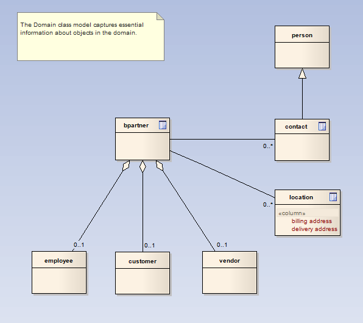
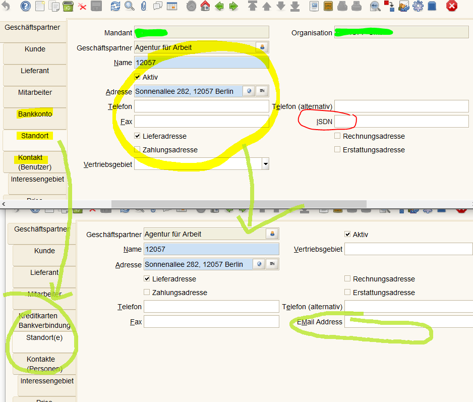
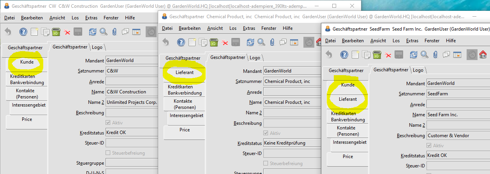
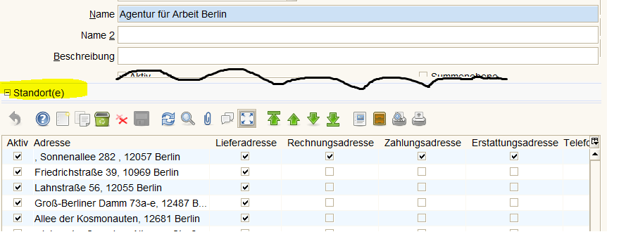

# UI Anpassen

## UI Anpassung am Beispiel Geschäftspartner

* ein Geschäftspartner ist ein Kunde oder ein Lieferant, oder beides. Oder ein Mitarbeiter.
* die Beziehung zu den Unterregistern ist 1:0..1
* das dynamische AD-Layout sollte das Unterregister Kunde nur anzeigen, wenn es sich um einen Kunden handelt
* die Beziehung zum Unterregister Bank ist 1:0..n : ein Geschäftspartner hat keine oder mehrere Bankverbindungen hinterlegt
* ebenso die Unterregister Kontakte und Standorte : ein Geschäftspartner kann mehrere Standorte haben

Im folgenden Beispiel werden
* die Benennungen der Register angepasst, um den Charakter des Registers gerecht zu werden. Es gibt mehrere Standorte.
* die "veraltete" Information ISDN wird durch `eMail` ersetzt
* das Layout wird etwas verändert
  * Felder `Mandant` und `Organisation` sind redundant und nicht notwendig
  * Felder mit Bezug zu Adresse wurden dorthin gruppiert

### conditional Tab

Ist ein Geschäftspartner ein Kunde, so ist es sinnvoll die Tabs Lieferant und Mitarbeiter dynamisch auszublenden:

### embedded Tab

Im zweiten Schritt wird das Register `Standorte` als ein "embedded Tab" definiert, so dass alle Standortattribute als Einzelzeilen sichtbar sind

embedded Tabs werden auch an anderen Stellen verwendet. In [Angeboten und Aufträgen](../usr/2.3-sales.md) zum Anzeigen der Auftragsposten. In Bestellungen, Lieferscheinen und Rechnungen.

