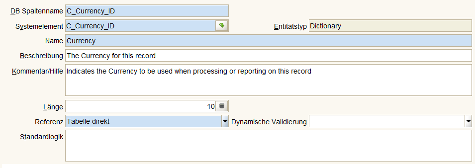
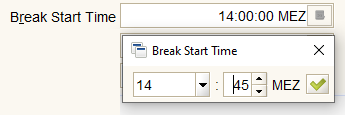
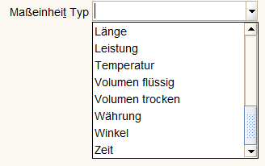
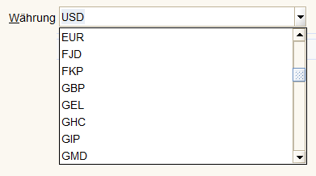
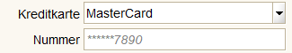

# Referenzen/Datentypen

Datentypen in Adempiere sind mehr als Datenbankdatentypen (Character, String, Numeric, Date, ...). Jedem Tabellenfeld ist eine Referenz zugeordnet. Diese Referenz bestimmen den Datentyp, die statische Validierung und die Präsentation. In Tabelle AD_Reference gibt es 34 Enträge mit entitytype='D' und validationtype='D'. Zusätzlich bestimmen Systemelemente die Gleichartigkeit von Feldern und die dynamischer Validierung kann die statische Validierung ergänzen. Siehe auch [Entering Data (en)](https://adempiere.gitbook.io/docs/v/develop/introduction/getting-started/entering-data-fields-and-buttons)

Zuordnung von Referenz, Systemelement und dynamischer Validierung:

Es gibt elementare, einfache Referenzen (Yes-No, String) und komplexe wie Adresse oder Lagerort.

## [Yes-No](https://adempiere.gitbook.io/docs/v/develop/introduction/getting-started/entering-data-fields-and-buttons#yes-no)

## [String](https://adempiere.gitbook.io/docs/v/develop/introduction/getting-started/entering-data-fields-and-buttons#string)

## Zeitangaben

### Date

### Time

### Date+Time

ist eine Kombination aus Date und Time

## Auswahlfelder

Felder können anhand fest definierten Listen validiert werden (**List**). Es sind ca 300 Validierungslisten definiert. Beispiel: Maßeinheiten werden in verschiedene Typen (es sind 21) eingeteilt:  

Oder gegen den Inhalt von Tabellen (**Table Direct**), Wähungen werden in Tabelle ``C_Currency`` gepflegt:

Die Präsentation ist in beiden Fällen eine [Combobox](https://docs.oracle.com/javase/tutorial/uiswing/components/combobox.html).

## [Adresse](https://adempiere.gitbook.io/docs/v/develop/introduction/getting-started/entering-data-fields-and-buttons#location-address)

## [Lagerort](https://adempiere.gitbook.io/docs/v/develop/introduction/getting-started/entering-data-fields-and-buttons#locator-wh)

## Obscure

Für besondere Felder gibt es die Obscure Präsentation, z.B. bei Kreditkartennummern werden nur die letzten 4 Ziffern angezeigt:

## System Display Types

Die möglichen Feldpräsentation werden in Klasse ``org.compiere.util.DisplayType`` festgelegt. 

	public static final int String     = 10;
	public static final int Integer    = 11;
	public static final int Amount     = 12;
	public static final int ID         = 13;
	public static final int Text       = 14;
	public static final int Date       = 15;
	public static final int DateTime   = 16;
	public static final int List       = 17;
	public static final int Table      = 18;
	public static final int TableDir   = 19;
	public static final int YesNo      = 20;
	public static final int Location   = 21;
	public static final int Number     = 22;
	public static final int Binary     = 23;
	public static final int Time       = 24;
	public static final int Account    = 25;
	public static final int RowID      = 26;
	public static final int Color      = 27;
	public static final int Button	   = 28;
	public static final int Quantity   = 29;
	public static final int Search     = 30;
	public static final int Locator    = 31;
	public static final int Image      = 32;
	public static final int Assignment = 33;
	public static final int Memo       = 34;
	public static final int PAttribute = 35;
	public static final int TextLong   = 36;
	public static final int CostPrice  = 37;
	public static final int FilePath   = 38;
	public static final int FileName   = 39;
	public static final int URL        = 40;
	public static final int PrinterName= 42;
	public static final int Chart           = 53370;
	public static final int FilePathOrName  = 53670;

