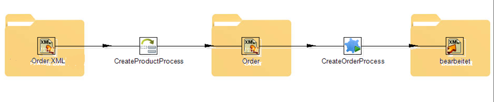
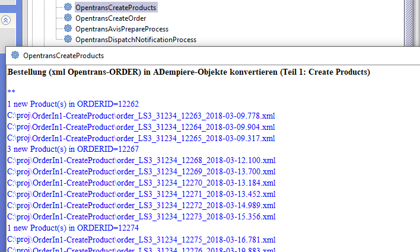

# openTRANS Anbindung

[openTRANS](https://de.wikipedia.org/wiki/OpenTRANS) ist ein offener XML-Standard entwickelt auf Initiative des Fraunhofer IAO zur Unterstützung des elektronischen Datenaustauschs (EDI) bei Geschäftstransaktionen zwischen Handelsunternehmen.

Im [Benutzerhandbuch](../usr/4.opentrans.md) wird ein konkreter Fall beschrieben.

Im ersten Schritt wird das Konvertieren der openTRANS-ORDER Nachrichten implementiert, um Adempiere-Order zu erzeugen.
Im zweiten Implementierungsschritt werden alle Methoden implementiert, die zum Produktumfeld gehören. In Folgeschritten wird der Auftrag mit seinen Positionen und das Abhandeln der Lieferavis implementiert.

## OpenTRANS nach ADempiere

Wie geschieht das Mapping der OpenTRANS-Objekte in adempiere-Objekte?

Dieser Transformation geschieht in zwei Schritten

- standard JAXB-[unmarshaller](http://www.devx.com/Java/Article/34069), daraus entstehen [openTRANS-ORDER pojo's](https://de.wikipedia.org/wiki/Plain_Old_Java_Object) in Methode `Transformer.toModel(...)` in package `com.klst.opentrans` 
- Mapping openTRANS-pojo nach adempiere-Objekte

Beispiel: diese Methode liest ein xml-openTRANS-ORDER und liefert die pojo Klasse ORDER
```java
	protected ORDER unmarshal(String uri) {
		ORDER order = null;
		OPENTRANS ot;
		try {
			File file = new File(uri);
			InputStream is = new FileInputStream(file);
			ot = transformer.toModel(is);
			order = ot.getORDER();
		} catch ...
		return order;
	}
```

## Grober Aufbau einer OpenTRANS-Order

Die Details kann man im xsd-file nachlesen, welches sich im opentrans.jar befindet. ORDER besteht aus 1 bis n ORDER_ITEMs, die detailieter beschrieben werden:
```xml
<OPENTRANS>
   <ORDER type="standard"  ... >
      <ORDER_HEADER>
         <ORDER_INFO>
            <ORDER_ID>8566</ORDER_ID>
...
      <ORDER_ITEM_LIST>
         <ORDER_ITEM>
            <LINE_ITEM_ID>1</LINE_ITEM_ID>
            <PRODUCT_ID>
               <bmecat:SUPPLIER_PID>302208250</bmecat:SUPPLIER_PID>
               <bmecat:BUYER_PID type="BZRNR"/>
               <bmecat:DESCRIPTION_SHORT>Schneider Kugelschreiber K20 Icy</bmecat:DESCRIPTION_SHORT>
            </PRODUCT_ID>
            <QUANTITY>40</QUANTITY>
            <bmecat:ORDER_UNIT>PCE</bmecat:ORDER_UNIT>
            <PRODUCT_PRICE_FIX> ...
...
         </ORDER_ITEM>
...
```
Die openTRANS-pojos werden in folgende adempiere-Objekte abgebildet:

-    ORDER -> MOrder
-    ITEM -> MOrderLine
-    PRODUCT_ID -> MProduct , dabei werden bei Bedarf neue Produkte angelegt
-    ORDER_UNIT -> MUoM, der oben erwähnte "Six pack", oder PCE im xml-Beispiel
- ...

Das Abbilden von openTRANS PRODUCT in adempiere-MProduct ist einiges kompelxer als die simple Maßeinheit, denn es müssen diverse DB-Modell-Randbedingungen beachtet werden (Preise, Steuern, Lieferant, Produktkategorie, Maßeinheit). 

## Prozessklassen

### `CreateProductProcess`

Abschliessend wird noch eine Prozessklasse `CreateProductProcess`  benötigt, die adempiere-Produkte für mehrere OpenTRANS-Order erstellt, etwa mit solcher Methode:

`createProductIfNew(ORDERITEM item, int dropShipBPartner_ID) ...`



`CreateProductProcess` kann dann überwacht oder im Hintergrund den ersten Teil des oben beschriebenen Workflows verrichten. Unser Kunde hat sich für den überwachten Ablauf entschieden, da damit eventuelle Störungen sofort erkennbar sind. Der zuständige Mitarbeiter startet den Prozess per Mausklick und bekommt gleich ein Feedback wie viele Objekte erstellt wurden:



### `CreateOrderProcess`

Nachdem alle Produkte für den Auftrag erstellt sind, kann mit `CreateOrderProcess` der adempiere-Auftrag erstellt werden. Damit ist die Bearbeitung der openTRANS-ORDER abgeschlossen.

Der Lieferavis (in openTrans Terminologie DISPATCHNOTIFICATION), also die Ankündigung einer Lieferung hat in ADempiere kein Gegenobjekt. Am ehesten kann man DISPATCHNOTIFICATION auf einen Lieferschein abbilden. Die Lieferavis, die wir bekommen sind in einem XML-Format, das nicht ganz den Vorgaben von `opentrans_2_0.xsd` entspricht. Die Unterschiede sind gering. Daher werden die Avis-Datenströme mittels `AvisPipedInputStream` so angepaßt, damit sie den entsprechenden openTRANS Vorgaben entsprechen. 
 
### Avis Prozesse

Für das Lieferavis gibt es zwei Prozesse:

- `AvisPrepareProcess` erstellt eine Kopie des XML-Avis im openTRANS 2.0 Format. Mit einer CSS-Definition kann der Nutzer die Avis Inhalte zur Kontrolle im XML-Browser (IE) lesen.
- `DispatchNotificationProcess` beinhaltet die eigentliche Transformation und erstellt zum Avis den entsprechenden adempiere-Lieferschein, aus dem die Rechnung generiert werden kann.
 

