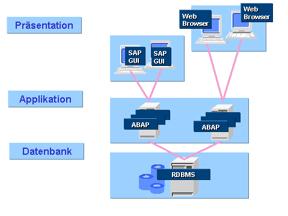

# Architektur vs. Anatomie

In der Informatik gibt es den Bergiff der [Softwarearchitektur](https://de.wikipedia.org/wiki/Softwarearchitektur). Der Begriff Anatomie ist im Softwarekontext nicht gebräuchlich. Dabei ist die heute verfügbare Software oft schlecht dokumentiert und die ursprünglichen Architekturentscheidungen nicht mehr im Detail nachvollzielbar. Das gilt insbesondere für reifere [Open Source](https://de.wikipedia.org/wiki/Open_Source)-Systeme wie ADempiere. Reifere Systeme sind in einem evolutionären Prozess über mehrere Generationen gewachsen.

Wenn hier die Architektur dokumentiert wird, dann sind es meist nicht Ergebnisse von Entwurfsentscheidungen, sondern die anatomischen Entdeckungen, die bei der Pflege und Weiterentwicklung des Systems angefallen sind.

Anatomie | Software Architetktur
-------- | -------------
 | 

## Client-Server-Architektur

ADempiere is als [Client-Server-System](http://de.wikipedia.org/wiki/Client-Server-Modell) aufgebaut, bestehend aus zwei oder drei Schichten. Siehe auch [Schichtenarchitekturen nach Anzahl der Schichten](http://de.wikipedia.org/wiki/3-Tier-Architektur#Schichtenarchitekturen_nach_Anzahl_Schichten).

Wie viele [ERP](https://de.wikipedia.org/wiki/Enterprise-Resource-Planning)-Systeme ist ADempiere als [verteiltes 3-tier System](https://de.wikipedia.org/wiki/Schichtenarchitektur#Drei-Schichten-Architekturen_bei_verteilten_Systemen) aufgebaut. Die klassische 3-Tier-Architektur am Beispiel [SAP ERP](https://de.wikipedia.org/wiki/SAP_ERP), Bild siehe oben.

es gibt diese drei Schichten:
* Präsentation: auf Client-Seite gibt es mehrere UI Varianten
* Applikationsserver
* DBMS oder Datenbank-Schicht

Zu einer 3-Tier-Architektur bei ADempiere gab es die [Überlegungen](http://www.adempiere.com/Adempiere_Architecture_3_tier).

## Datenbank-Schicht

http://www.adempiere.com/Table_Prefix

## Applikationsschicht

Serverschicht/Base

## Präsentationsschicht

zwei Clients
* Swing
* WEB

## Fehlentwicklungen

Im Zuge der Evolution entstehen Fehlentwicklungen. Auch Softwaresysteme sind davon nicht ausgenommen. Hier eine Liste, die meiner Ansicht nach Fehlentwincklungen sind:

* Locale zur [Internationalisierung](https://de.wikipedia.org/wiki/Internationalisierung_%28Softwareentwicklung%29) führt zur Redundanzen in Übersetzungen
* Postleitzahlen und tel.Vorwahl, postal und areacode als Attribute von City
* Umsatzsteuer, Abhängigkeit vom Land des Käufers nicht vorgesehen 
* zyklische Abhängigkeiten in Unterprojekten [siehe Circular Dependencies](https://github.com/adempiere/adempiere/issues/2231)