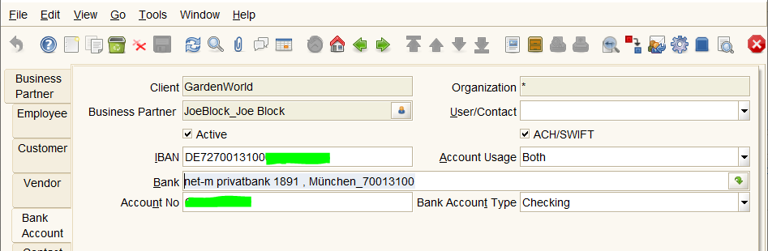

# Referenzdaten

Referenzdaten, wie Länder, Sprachen oder Maßeinheiten sind mandantenübergreifend. Sie sollten daher vom `system` allen Mandanten bereitgestellt werden. Es macht keinen Sinn, dass Mandanten Referenzdaten pflegen

## Banken

Bei Bankreferenzdaten es handelt sich nicht um Kontodaten, sondern um Daten der Kreditinstitute, also BIC/SWIFT-Code, Adressen und Namen der Banken. In Deutschland stellt die Bundesbank aktualisierte Bankdaten bereit, siehe [idempiere Bank](https://wiki.idempiere.org/de/Bank_%28Fenster_ID-158%29#Beitr.C3.A4ge). Mit einem `bank import`-Programm lassen sich die Bundesbankdaten in *Dempiere `c_bank` überführen.  

**Überlegungen zu einem `bank import`-Programm**

Der Zweck der Daten in `c_bank` ist einerseits für einen Mandanten die Daten der eigenen Bank bereitzustellen. Feld `c_bank.isownbank`. Diese Information ist mandantenspezifisch. Andererseits sollten zu Bankdaten der Geschäftspartner, also zu mandantenspezifische Kontodaten die neutralen Informationen über die Bank selbst erfahren werden können.

Beispiel: der Demo Mandant 11 "Garden World" hat zwei "eigene" Hausbanken. Die Namen "MoneyBank" und "POS Transfer Control Bank" sind erfunden. Ich unterstelle mal, dass "Garden World" ein Mandant mit deutschen Hausbanken wäre und ändere die Namen:
* Mandant 11 "Garden World"-OHG hez zwei Hausbanken, die "Hausbank München" und die "Sparda-Bank München"
* es gibt noch andere Mandanten 1000000 "ABC GmbH", der in Wuppertal ansässig ist. Und 1000001 "Brasil Ltd" mit Sitz ausserhalb der EU
* die Mandanten sollten nichts übereinander wissen und daher sind die Informationen über die jeweils eigenen Banke mandantenspezifisch.

* Beide Mandanten haben natürlich Geschäftspartner (BP Business Partner)
* "Joe Block" ist der BP von "Garden World"
* "Garden World" hat die IBAN von "Joe Block". Zum 1. Februar 2016 ersetzte die IBAN in der EU die bestehenden nationalen Kontonummern bei Überweisungen. Daher genügt die IBAN. Ein anderer BP "Mark Cent" hat seinen Sitz außerhalt der EU. Die Kontodaten von "Joe Block" und "Mark Cent" sind für "ABC Gmbh" nicht sichtbar, weil sie mandantenspezifisch sind, Tabelle c_bankaccount_id

* Aus der IBAN kann man die nur herauslesen, dass "Joe Block" ein Konto bei einer DE-Bank hat. Ausserdem läßt sich die IBAN validieren.
* würde ADempiere DE Bankdaten bereitstellen, liesse sich aus der IBAN die Bank ermitteln. Es ist die "net-m privatbank 1891, München"
* jede Mandant könnte die Liste der DE Kreditinstitute mit Name und BIC/SWIFT-Code einsehen
* für den Mandanten "Brasil Ltd" wäre das wichtig, dann er muss bei Überweisungen den SWIFT-Code und die IBAN angeben.
* Auch für "Garden World" wären Banken Daten notwendig, den der Mantant unterhält Beziehingen zu türkischen Partnern und für Überweisungen wird der SWIFT-Code benötigt

Es wäre daher sinnvoll, für bestimmte Länder die Bankdaten bereitzustellen. Vollständig oder partiell. Die fehlenden Informationen kann den Mandantnutzer nachtragen. Unsichtbar für die anderen Mandanten. 

Die DE-Bankdaten werden von der Bundesbank vierteljährlich aktualisiert. Die Österreichische Nationalbank stellt ein SEPA-Zahlungsverkehrs-Verzeichnis bereit. Das Format ist anders, die Häufigkeit der Aktualisierung nicht definiert. Das heißt:
* für jedes Land muss ein anderes `import`-Programm existieren
* es sei denn, dass es einen minimalen Datenbestand an SWIFT-Codes gibt
* den gibt es, allerdings ist die Aktualität und die Qualität nicht nachprüfbar, siehe [swiftcode](https://github.com/homebeaver/swiftcode)

### Elemente der Tabelle `c_bank` :
	
	name 
	description 
	routingno // nationale Bankleitzahl
	swiftcode // auch BIC (Bank Identifier Code) genannt ist eine Art internationale Bankleitzahl
	isownbank : 'Y' oder 'N' // oben beschrieben
	c_location_id // Verweis auf die Adresse der Bank

// die restlichen zwei Spalten wurden in [Bank as Cash](https://github.com/adempiere/adempiere/projects/18) eingeführt   

	banktype : 'B' (default) für Bank oder BANKTYPE_CashJournal = "C" 
	c_bpartner_id  

### SWIFT-Code

Ein "SWIFT-Code" (Society of Worldwide Interbank Financial Telecommunications), manchmal auch BIC (Bank Identifier Code) genannt, ist eine internationale Bankleitzahl. Sie ist 8 oder 11-stellig. Beispiel: MARKDEFF 
* die ersten vier Zeichen sind der Bankcode (Bundesbank z.B. MARK), 
* es folgen ein zweistelliger Ländercode (in Deutschland also DE), 
* ein ebenfalls zweistelliger Ortscode (z.B. FF für Frankfurt) 
* und optional drei Stellen Branchencode zur Identifikation von Filialen. 
Weitere Details unter https://www.swift.com/standards/data-standards/bic-business-identifier-code

### staging-Tabelle

Ein `bank import`-Programm sollte zweigeteilt sein. Der erste Teil liest die national unterschiedlichen Formate in eine entsprechende staging-Tabelle. Der zweite Teil bildet die Elemente der staging-Tabelle in `c_bank` ab.

DE-bank-import: 
1. staging löschen, DE-blz.txt file mit festem Satzaufbau nach DE-staging
1. staging nach `c_bank` nach einer DE-Mapping Vorschrift

AT-bank-import:
1. staging löschen, AT-blz.csv file, semikolon separated nach AT-staging
1. staging nach `c_bank` nach einer AT-Mapping Vorschrift

Generisch: (einteilig, wegen Symetrie ebenfalls zwei Programmteile) 
1. staging löschen, beliebiges Land json-file, z.B. AD/Andorra nach staging. Der Aufbau der json-files ist einheitlich.
1. staging nach `c_bank` nach einer abstrakten Mapping Vorschrift
