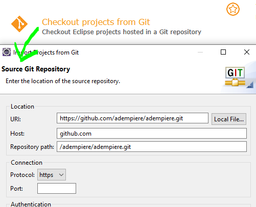
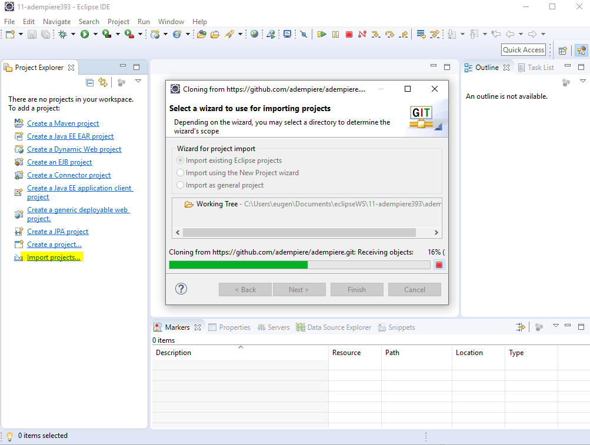
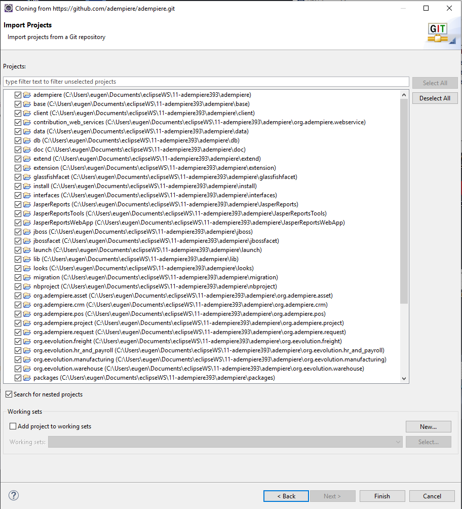

# Entwicklungsumgebung

Allgemeines zu [Eclipse als IDE in wikipedia](https://de.wikipedia.org/wiki/Eclipse_%28IDE%29). Man sollte sich für eine neuere Version entscheiden. Älter als [V.4.7/Oxygen](https://de.wikipedia.org/wiki/Eclipse_%28IDE%29#Versionen) sollte die IDE nicht sein.

## Anbindung an Git

Mit [EGit](http://eclipse.org/egit) ist die Anbindung der IDE an beliebige git-Versionsverwalungssysteme gegeben.

## Adempiere in eclipse

Die vielen Verzeichnisse im git-[Repository](https://de.wikipedia.org/wiki/Repository) entsprechen in eclipse den Projekten in einem Workspace.

* zuerst soltte man also ein eclipse workspace, z.B. ``Adempiere39`` anlegen
* dann aus dem Repository den entsprechenden Branch kopieren / in git Terminologie wird dieser Vorgang "cloning" genannt, siehe [Github forking](ide.md#forking)

* es dauert ein wenig bis die ca. 2GB kopiert werden

* Nach dem Klonen werden die eclipse Projekte importiert/erstellt. Zu einer Fehlentwicklung gehört m.E. die Definition von adempiere als ein eclipse Projekt. Also ohne nested projects. Dies ist nirgendwo dokumentiert. In eclipse gibt es folgende Möglichkeiten:

** importieren des Hauptprejektes ``adempiere`` als ein Projekt (no nested projects)
** importieren der git-Unterverzeichnisse als mehrere Projekte, also  ``base``, ``client``, ... usw.
** importieren des Hauptprojektes und der Unterprojekte

Die git-Unterverzeichnisse sind manchmal als eclipse Projekte definiert, manchmal nicht. Oft ist die Definition von ``.project`` und ``.classpath`` nicht korrekt oder nicht aktuell. 