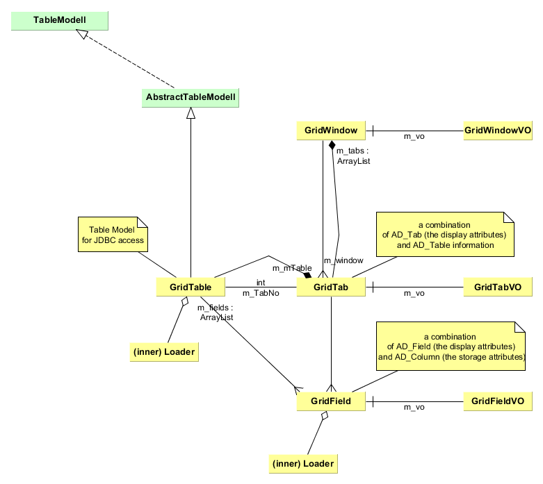

# Grid

Das grid Modell ist ein zentraler Bestandteil im base Subprojekt. Die Klassen stammen noch aus compiere und sind demnach im ```org.compiere.model``` package. Im folgenden Diagramm sind die wichtigsten grid Klassen abgebildet.

* GridWindow modelliert einen Container und besteht oft aus mehreren Reitern (Tabs)
* GridTabs wiederum besteht aus mehreren Feldern, den GridFields
* ein GridField ist die Kombination von Feldattributen, die definieren wie ein Feld dargestellt wird, und Column Attributen, die definieren wie die Felddaten gespeichert werden. Die Metadatentabellen ```AD_colum``` und ```AD_Field``` speichern diese Informationen
* zu GridField, GridTabs und GridWindow existieren Value Objects (VO), Klassen die konkrete Objekte kapseln



