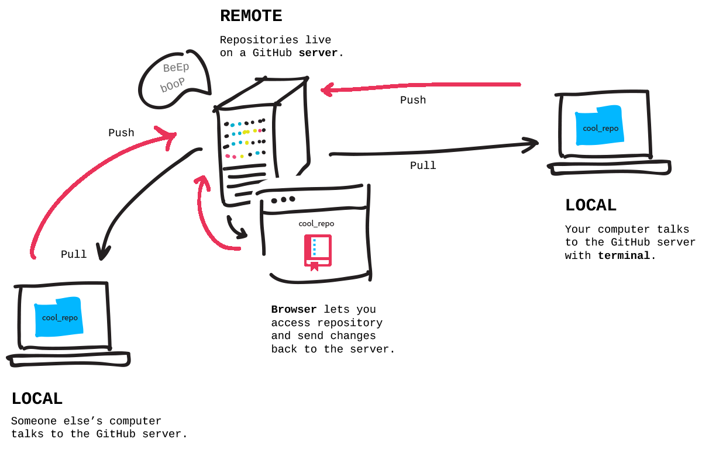
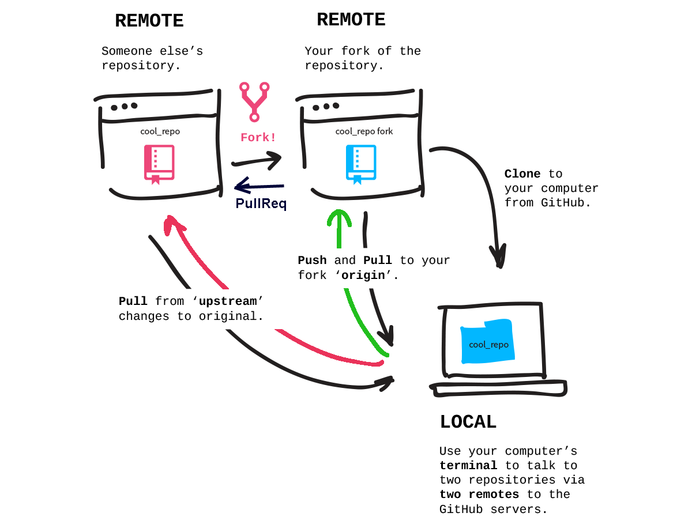

# Entwicklungsumgebung

Es gibt [viele](https://de.wikipedia.org/wiki/Liste_von_Integrierten_Entwicklungsumgebungen) [integrierte Entwicklungsumgebungen/IDEs](https://de.wikipedia.org/wiki/Integrierte_Entwicklungsumgebung). Zwei werden sich für das Development von Adempiere favorisiert. Unabhängig davon für welche IDE man sich entscheidet, die Wahl des Versionsverwaltung ist nicht frei, denn die zentrale Ablage für das Adempiere Projekt ist git, genauer [GitHub](https://de.wikipedia.org/wiki/GitHub).

## Konfigurationsmanagement

zum [Softwarekonfigurationsmanagement/SCM](https://de.wikipedia.org/wiki/Software-Configuration-Management) gehört die Versionsverwaltung von Ergebnissen, Quellen und Dokumenten, Change-Management und Änderungsverfolgung, Build und Deployment. 

Die zentrale Versionsverwaltung und das Change-Management befinden sich auf GitHub unter https://github.com/adempiere/adempiere.

### Versionsverwaltung

Es gibt unzählige [Version Control Systeme/VCS](https://de.wikipedia.org/wiki/Versionsverwaltung#Beispiele). Neben lokalen Systemen [Unix-SCCS](http://de.wikipedia.org/wiki/SCCS) und den klassischen zentralen Systemen [CVS](http://www.cvshome.org/) oder [Apache Subversion](http://subversion.apache.org/) gibt es die verteilten DVCSe (Distributed Version Control System). Einen guten Einblick bietet der folgende [Artikel](http://www.heise.de/developer/artikel/Die-neue-Freiheit-bei-der-Versionskontrolle-1224755.html).

Neuere Systeme zur Versionsverwaltung sind verteilt. Es gibt keinen eindeutigen Server mit dem Sourcecode-Repository. Bekannte DVCS-Vertreiter sind Mercurial hg, [Git](https://git-scm.com/docs) und Bazaar.  

### Github

[Github](https://de.wikipedia.org/wiki/GitHub) ist ein webbasierte Dienst für Git-Projekte wie [ADempiere](https://github.com/adempiere/adempiere).

* die [adempiere repo Administratoren](https://github.com/adempiere/adempiere/graphs/contributors) mit Schreibrechten sind [Victor Perez](https://github.com/e-Evolution) und [Yamel Senih](https://github.com/yamelsenih)
* weitere Ansprechpartner: 
 * [Michael McKay](https://github.com/mckayERP), 
 * [Michael Judd majjudd@gmail.com](https://github.com/majjudd), 
 * [mario.calderon@westfalia-it.com](https://github.com/marcalwestf), 
 * [susanne.de.calderon@westfalia-it.com](https://github.com/SusanneCalderon)
 
* [Github features](https://github.com/tiimgreen/github-cheat-sheet#github-cheat-sheet-)

#### Forking

* wir haben nur lesenden Zugriff auf [adempiere github repo](https://github.com/adempiere/adempiere)
* wenn ich also lokal eine Kopie/clone des adempiere repo mache, dann darf ich zwar ein checkout/pull machen, aber *keinen push*



* ergo kann ich keine von mir erstelltn Änderungen einspielen

* mit einem REMOTE-fork [repo klst-com/adempiere](https://github.com/klst-com/adempiere), das ich ebenfalls lokal clonen kann, lässt sich das commit-Problem umgehen
* denn ich habe als owner *schreibenden Zugriff* auf den REMOTE fork 



* link:[fork-and-clone-an-open-source-repository](https://github.com/Rafase282/My-FreeCodeCamp-Code/wiki/Lesson-Save-your-Code-Revisions-Forever-with-Git#fork-and-clone-an-open-source-repository)
* abschliessend kann ich mit einem *pull-request* meine Änderungen an das adempiere repo weitergeben, wo einer der Administratoren es in das Projekt integriert (merge), siehe https://github.com/adempiere/adempiere/pulls - oder auch nicht: [closed pulls](https://github.com/adempiere/adempiere/pulls?q=is%3Apr+is%3Aclosed+author%3Ahomebeaver)


#### pull-requests

siehe https://help.github.com/en/articles/about-pull-requests 

Beispiel: PR zu [Ticket 1340](https://github.com/adempiere/adempiere/issues/1340) "Enlarge length for address ..."

* neuen branch erstellen, dieser sollte vom branch "develop" abgeleitet sein (das Folgende erstellt den branch und checkt ihn gleich aus):

```cmd
ad391> git checkout -b dev+1340 remotes/klst-de/develop
```

* files hinzufügen oder ändern ...
* mit status Änderungen prüfen, da gibt es tipps:

```cmd
ad391>git status
On branch dev+1340
Your branch is up-to-date with 'klst-de/develop'.
Untracked files:
  (use "git add <file>..." to include in what will be committed)

        migration/391lts-392lts/04540_1340_Enlarge_length_for_address.xml

nothing added to commit but untracked files present (use "git add" to track)
```

* neue files mit add registrieren und committen mit -m/--message=<msg> :

```cmd
ad391>git add migration/391lts-392lts/04540_1340_Enlarge_length_for_address.xml
ad391>git commit -m "Enlarge length for address, email, description"
[dev+1340_length 8f63f6d] Enlarge length for address, email, description
 1 file changed, 54 insertions(+)
 create mode 100644 migration/391lts-392lts/04540_1340_Enlarge_length_for_address.xml
```

* push diesen branch zu meinem remote github repo :

```cmd
ad391>git push klst-de dev+1340 
...
Counting objects: 5, done.
Delta compression using up to 8 threads.
Compressing objects: 100% (5/5), done.
Writing objects: 100% (5/5), 942 bytes | 0 bytes/s, done.
Total 5 (delta 3), reused 0 (delta 0)
remote: Resolving deltas: 100% (3/3), completed with 3 local objects.
remote:
remote: Create a pull request for 'dev+1340' on GitHub by visiting:
remote:      https://github.com/klst-de/adempiere/pull/new/dev+1340
remote:
To https://github.com/klst-de/adempiere.git
 * [new branch]      dev+1340 -> dev+1340
```

* Abschliessend auf github mit diesen branch den ["pull request"/PR](https://github.com/adempiere/adempiere/pull/2480) erstellen für https://github.com/adempiere/adempiere

#### Cherry-picking

Beispiel: Issue https://github.com/adempiere/adempiere/issues/2231

Der erste [PR 2232](https://github.com/adempiere/adempiere/pull/2232) wurde nicht integriert, -> Closed with unmerged commits.
Denn die commits fielen zeitlich mit der Relrasefreigabe von 3.9.1 zusammen. Im zweiten Anlauf mußten die commits aus dem pull 2232 rausgepickt werden und in einem neuen PR bereitgestellt werden. Die dabei entstehenden Konflikte müssen aufgelöst werden. Diesen Vorgang nennt man cherry-picking.

PR 2232 besteht aus mehreren commits. Hier das cherry-picking im cmd-line modus:

* schon beim ersten commit gibt es Konfilkte

```cmd
ad391> git cherry-pick --strategy=recursive --strategy-option=theirs 76187c581a0275aad3ede6e58445d7e25543cc5d
error: addinfo_cache failed for path 'zkwebui/.classpath'
error: addinfo_cache failed for path 'org.adempiere.pos/.classpath'
error: addinfo_cache failed for path 'org.adempiere.crm/.classpath'
error: addinfo_cache failed for path 'base/src/org/compiere/model/MRequestUpdate.java'
error: addinfo_cache failed for path 'base/src/org/compiere/model/MRequestProcessorRoute.java'
error: addinfo_cache failed for path 'base/src/org/compiere/model/MRequestProcessorLog.java'
error: addinfo_cache failed for path 'base/.classpath'
error: addinfo_cache failed for path 'JasperReports/.classpath'
U       JasperReports/.classpath
U       base/.classpath
U       org.adempiere.crm/.classpath
U       org.adempiere.pos/.classpath
U       zkwebui/.classpath
error: commit is not possible because you have unmerged files.
hint: Fix them up in the work tree, and then use 'git add/rm <file>'
hint: as appropriate to mark resolution and make a commit.
fatal: Exiting because of an unresolved conflict.
```

* Auflösung im Editor oder in diesem Fall mit der "theirs"-Strategie und anschliessendem commit, einmal für die updates, dann für die renames:

```cmd
ad391> git commit
U       JasperReports/.classpath
U       base/.classpath
U       org.adempiere.crm/.classpath
U       org.adempiere.pos/.classpath
U       zkwebui/.classpath
error: commit is not possible because you have unmerged files.
hint: Fix them up in the work tree, and then use 'git add/rm <file>'
hint: as appropriate to mark resolution and make a commit.
fatal: Exiting because of an unresolved conflict.

ad391>git commit -a
[dev+2231 cddcb3a] avoid cyclic project dependences between base, project, request
 Date: Wed Dec 19 11:24:02 2018 +0100
 87 files changed, 260 insertions(+), 280 deletions(-)
 rename {org.adempiere.request/src/main/java => base/src}/org/compiere/apps/Request.java (100%)
 rename {org.adempiere.project/src/main/java => base/src}/org/compiere/model/CalloutProject.java (100%)
 rename {org.adempiere.request/src/main/java => base/src}/org/compiere/model/CalloutRequest.java (100%)
 rename {org.adempiere.request/src/main/java => base/src}/org/compiere/model/MChangeRequest.java (100%)
 rename {org.adempiere.request/src/main/java => base/src}/org/compiere/model/MContactInterest.java (100%)
```

* die restlichen commits (ohne Konflike):

```cmd
ad391>git cherry-pick --strategy=recursive --strategy-option=theirs 4beca5aca3fc8d3266e3f86a56f9bd69cef19bf7
[dev+2231 250bb1a] eclipse project name same to git name
 Date: Thu Dec 20 13:39:13 2018 +0100
 1 file changed, 1 insertion(+), 1 deletion(-)

 ...
 
ad391>git cherry-pick --strategy=recursive --strategy-option=theirs 61c7429a087729e02b83c6a1e439ebfa7bdcbe0d
[dev+2231 97d929c] remove request+project from build
 1 file changed, 2 deletions(-)

```

## [Eclipse IDE](eclipse.md)

## https://de.wikipedia.org/wiki/IntelliJ_IDEA


