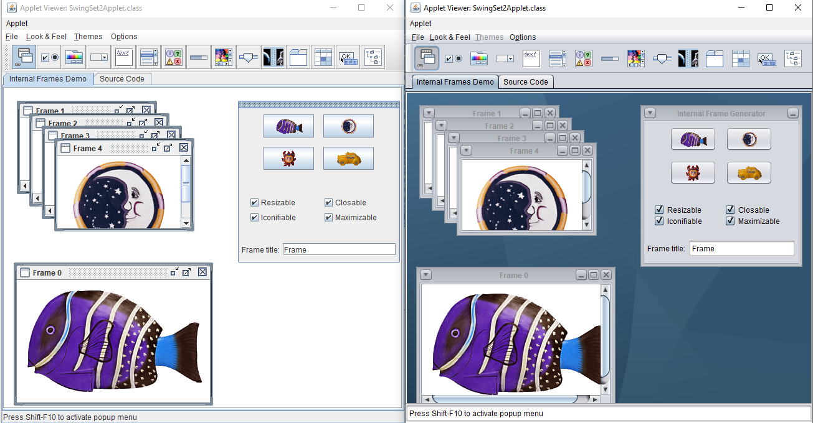

# Look and Feel

Das Erscheinungsbild (Programm Look&Feel/PLAF) des swing-clients wird von zwei Komponenten bestimmt, aus denen der Adempiere client besteht

* Java swing
* jgoodies, das auf Java Metal basiert

Zu einem "look" kann es verschiedene Themen geben. Farben und Schriften bestimmen ein Thema. Für das ursprüngliche Compiere gibt es die Klassen ```CompiereThemeBlueMetal``` und ```CompiereThemeIce```.

## Java swing look

In Java gibt es nur zwei "looks". Das bekannteste wird "Metal" genannt mit dem "Ocean"-Thema (links im Bild). Und das neuere, aber weniger bekannte "Nimbus".



Ausserdem können Javaprogramme das Erscheinungsbild der Betriebssysteme annehmen, unter denen sie arbeiten, also Windows, Motif oder GTK unter *nix.

Seit der Übernahme von Sun durch Oracle wird die Entwicklung von Swing nach und nach abgebaut. Die web-Seiten von [swinglabs](https://stackoverflow.com/questions/6818528/what-is-the-status-of-swinglabs-swingx-post-acquisition) sind nicht mehr online. Die Zukunft dieser Java Komponente ist besiegelt.

## jgoodies look

[JGoodies Software GmbH](http://www.jgoodies.com/) hat eine jar-Bibliothek bereitgestellt, die Java Metal erweitert. Das "look" hat der Entwickler "Plastik" genannt. Zu Plastik gibt es mehrere Themen.

* ```SkyBluer``` (medium blue primary colors and a light gray window background)
* davon abgeletet ```AbstractSkyTheme```: ```SkyBlue, SkyGreen, SkyKrupp, SkyPink, SkyRed, SkyYellow```
* davon ebenfalls abgeleitet ```DesertBluer```: ```DesertBlue, DesertGreen, DesertRed, DesertYellow, ExperienceBlue, ExperienceGreen, ExperienceRoyale, LightGray, Silver```
* und die dunklen Farben ```InvertedColorTheme```: ```BrownSugar, DarkStar```

Das vervendete ```looks-2.0.4.jar``` ist von 2006 und damit ziemlich veraltet. Der Entwickler stellt inzwischen keine kostenfreie Aktualisierungen bereit _I can no longer provide the libraries at no charge_. Die letzte kostenlose Version 2.5.3 stammt aus den Jahre 2013.

## sonstige jars

Es gibt noch weitere Bibliotheken, die das Look&Feel beeinflussen:

* ```swingx-1.6.jar```: von swinglabs mit package org.jdesktop.swingx aus dem Jahre 2009. Wie oben erwähnt werden die Arbeiten an swingx nicht mehr veröffentlicht. Die letzte verfügbare Version ist 1.6.6 vom Oktober 2013.
* ```miglayout-3.7.1-swing.jar``` vom [swedischen MiG InfoCom AB](http://www.miglayout.com/). Auch diese jar Version von 2009 ist überaltet. Die Version 4.0 is zwei Jahre jünger.
* mehrere kleine Komponenten wie die ```ColorBlind``` Klasse von Thomas Wolfmaier, [HCIRN](http://www.hcirn.com), das die Farben bei Farbschäche anpasst.