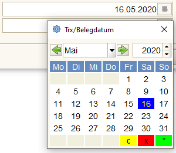
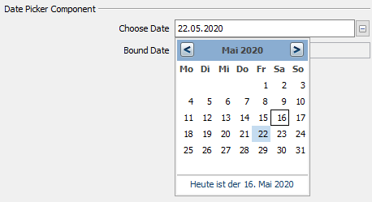
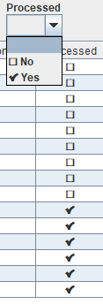

# Swing vs SwingX

## java Package javax.swing

[Quelle wikipedia](https://de.wikipedia.org/wiki/Swing_%28Java%29) : Swing ist ein UI-Paket/Package in Java. Es gehört zu den Java Foundation Classes (JFC), die eine Sammlung von Bibliotheken zur Programmierung von grafischen Benutzerschnittstellen UI bereitstellen. Swing baut auf dem älteren [AWT](https://de.wikipedia.org/wiki/Abstract_Window_Toolkit) auf und ist mit den AWT APIs verwoben. 

[Quelle oracle/javase/8](https://docs.oracle.com/javase/8/docs/api/javax/swing/package-summary.html#package.description) : Provides a set of "lightweight" components that, to the maximum degree possible, work the same on all platforms. For a programmer's guide to using these components, see [Creating a GUI with JFC/Swing](https://docs.oracle.com/javase/tutorial/uiswing/index.html), a trail in The Java Tutorial.

## SwingX Package [org.jdesktop](https://pirlwww.lpl.arizona.edu/resources/guide/software/SwingX/index.html?org/jdesktop/swingx/package-summary.html)

[Quelle rheinwerk-verlag.de](http://openbook.rheinwerk-verlag.de/java8/10_030.html) [tutego.de](http://www.tutego.de/blog/javainsel/2015/11/inselraus-die-zusatzkomponentenbibliothek-swingx/) : Die SwingX-Bibliothek erweitert Swing und füget Funktionalität hinzu und stellt ganz neue UI-Komponenten bereit, etwa eine Mischung aus Tabelle und Baum (JXTreeTable).

[Quelle javabeginners.de](https://javabeginners.de/Frameworks/SwingX/index.php) : SwingX ist ein Java-Package ``org.jdesktop`` von SwingLabs, das auf Swing aufsetzt und eine Reihe von Komponenten bereitstellt, die die Swing-Bibliothek erheblich erweitern und ergänzen. 

Nach der Übernahme von Sun durch Oracle wurden alle [SwingLabs Projekte](https://en.wikipedia.org/wiki/SwingLabs) gestoppt.

### VDate vs JXDatePicker

Ein konkretes Beispiel, das die Erweiterungen in SwingX zeigt, ist die Klasse ``org.jdesktop.swingx.JXDatePicker``. JXDatePicker erlaubt Datumseingabe im Textfeld mit Popup-Menü. Im Adempiere swing Client gibt es eine ähnliche Funktionalität, die mit viel Programmieraufwand erstellt wurde. Es sind die Klassen ``org.compiere.grid.ed.VDate`` und ``Calendar``:

Zum Vergleich ein Demo Screenshot mit JXDatePicker:

### Alternative zu VCheckBox 

Yes-No Datentypen werden in (swing) durch ``org.compiere.grid.ed.VCheckBox`` implementiert, das von  ``javax.swingJCheckBox`` abgeleitet ist. Der Renderer für die Darstellung ist gleichzeitig Editor für die Eingabe. Diese Entwurfsentscheidung impliziert zwei Werte, eben die [Yes-No](../adm/datatype.md#yes-no)-Werte. 

Yes-No Datentype werden auch als Auwahlfelder genutzt. Zum Beispiel in [Infofenstern](../usr/2.0-window.md#infofenster). Es ist bei diesen Auswahlen nicht möglich, beide Werte zu selektieren. Zur Lösung gibt es die Listenreferenz Yes-No, die auch optional, also ohne konnkreten Wert genutzt werden kann.

Seit in Unicode 6.0 sind Emojis einheitlich kodiert und als [UTF-Zeichen](https://emojipedia.org/) verfügbar. Das ist eine mögliche Alternative zur swing Darstellung. Es gibt mehrere Möglichkeiten, nur ein Beispiel:

* leer für Auswahl any/unknown
* ⬜ U+2B1C für No
* ✅ U+2705 für Yes 

So kann die Listenreferenz und der Renderer für Felder einheitlich gestaltet werden. Mit ``VCheckBox`` und ``VComboBox`` läßt sich das aber nicht implementieren. Statt ``VCheckBox`` wurde ``org.jdesktop.swingx.renderer.JRendererLabel``, statt ``VComboBox`` eine Subklasse von ``org.jdesktop.swingx.JXComboBox`` verwendet. Beide gehören zum SwingX-Paket.

### andere Beispiele

* [JXCollapsiblePane](https://javabeginners.de/Frameworks/SwingX/JXCollapsiblePane-Beispiel.php) ist von JPanel abgeleitet. Es bietet dessen Funktionalität, kann jedoch bei Bedarf animiert unsichtbar gesetzt werden.

* [JXFrame](https://javabeginners.de/Frameworks/SwingX/JXFrame-Beispiel.php) ist von JFrame abgeleitet, kann einen solchen problemlos ersetzen und stellt einige Erweiterungen, wie eine StatusBar und einen Zugriffstimer bereit.

* [JXTaskPane](https://javabeginners.de/Frameworks/SwingX/JXTaskPane-Beispiel.php) ist ist ein Container mit dem die schrittweise Abarbeitung von Aufgaben vorgegeben werden kann. Mehrere JXTaskPane werden üblicher- aber nicht norwendigerweise in einem JXTaskPaneContainer zusammengefasst.

* [JXTitledPanel](https://javabeginners.de/Frameworks/SwingX/JXTitledPanel-Beispiel.php) ist von JPanel und JXPanel abgeleitet. Es besitzt eine Titelzeile und einen separat konfigurierbaren Inhaltsbereich.

