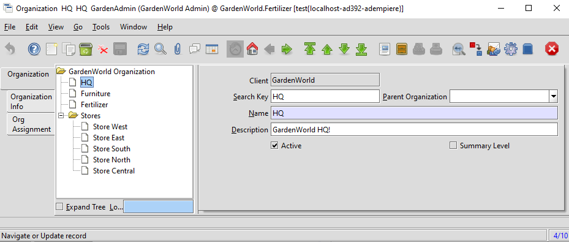
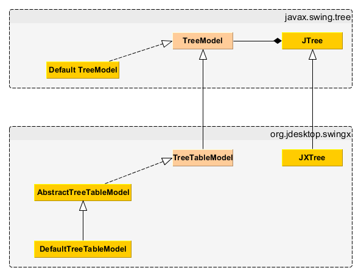

# Trees

* wo kommen Bäume in AD vor? Menu ist der bekannsteste AD-Baum. Aber auch für andere Entitäten, wie Aktivität, Artikel/Produkt und Geschäftspartener werden Bäume verwendet

```sql
select treetype,count(*),min(name),max(name) 
  from ad_tree 
 where ad_client_id in(0,11)
 group by 1
 order by 1

-- liefert
"AY";1;"GardenWorld Activity"           ;"GardenWorld Activity"
"BP";2;"(Primary Business Partner)"     ;"GardenWorld Bus Partner"
"CC";2;"CM Container"                   ;"GardenWorld SiteCC"
"CM";2;"CM Media"                       ;"GardenWorld SiteCM"
"CS";2;"CM Container Stage"             ;"GardenWorld SiteCS"
"CT";2;"CM Template"                    ;"GardenWorld SiteCT"
"EV";2;"(Primary Account Element Value)";"GardenWorld ElementValue (Account, etc.)"
"MC";1;"GardenWorld Campaign"           ;"GardenWorld Campaign"
"MM";1;"Menu"                           ;"Menu"
"OO";2;"(Primary Organization)"         ;"GardenWorld Organization"
"PJ";2;"(Primary Project)"              ;"GardenWorld Project"
"PR";2;"(Primary Product)"              ;"GardenWorld Product"
"SR";2;"(Primary Sales Region)"         ;"GardenWorld Sales Region"

```

* im Gegensatz zu vielen Entitäten werden die Knoteninformationen ```parent_ID``` und ```seqno``` von bestimmten Bäumen im saparaten Tabellen abgelegt. Spalte  ```ad_tree.treetype``` bestimmt den Suffix dieser Tabelle. Demnach werden Menuknoten nicht in ```ad_treenode```, sondern in ```ad_treenodeMM``` gehalten. Die Abbildung findet statt in Methode ```static int Mtree.getTableIdFromTreeType(String treeType)```
** Für Geschäftspartner/BP werden die Bauminformationen in ```ad_treenodeBP```, die restlichen Informationen, in ```c_bpartner``` gehalten
** Für Web-Container werden die Bauminformationen in ```ad_treenodeCMC```, die restlichen Informationen, in ```cm_container``` gehalten
** Symetrisch für Web Media Items ```ad_treenodeCMM```
** Symetrisch für Web Container Stage ```ad_treenodeCMS```
** Symetrisch für CM Template ```ad_treenodeCMT```
** Für Menus werden die Bauminformationen in ```ad_treenodeMM```, die restlichen Informationen, in ```ad_menu``` gehalten
** Für Artikel/Produkte werden die Bauminformationen in ```ad_treenodePR```, die restlichen Informationen, in ```m_product``` gehalten
* Aber 
** Knoteninfo für Buchungskonti ```C_ElementValue```/```ad_tree.treetype='EV'``` stehen in ```ad_treenode``` 
** ```ad_treenodeU1```
** ```ad_treenodeU2```
** ```ad_treenodeU3```
** ```ad_treenodeU4```
** Knoteninfo für Activity ```C_Activity```/```ad_tree.treetype='AY'``` stehen in ```ad_treenode``` 
** Knoteninfo für Organization ```ad_org```/```ad_tree.treetype='OO'``` stehen in ```ad_treenode```

Beispiel:



## Visualisierung

* wie werden sie in der UI visualisiert?


TODO



