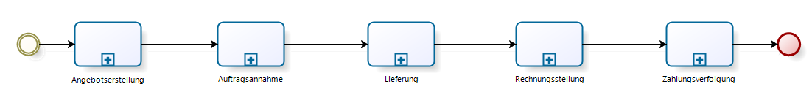

# Geschäftsprozesse und Menü

Geschäftsprozess am Beispiel Vertrieb

Das Benutzermenü in Adempiere orientiert sich nicht strikt nach Geschäftsprozessen. Die Intention ist in der ursprünglichen Bezeichnung des Menüpunktes "Quote to Invoice" / "Vom Angebot zur Rechnung" erkennbar. Die "Zahlungsverfolgung" ist im Menü unter "Offene Posten" untergebracht.

