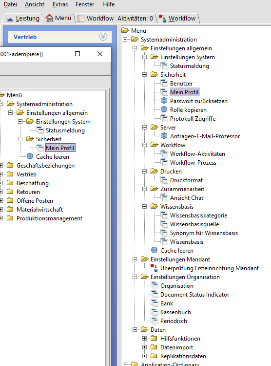
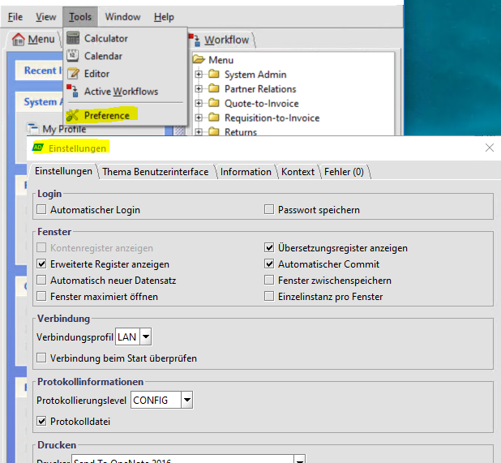

# Systemadministration

Um die [Systemadministration](../adm/README.md) muss sich der Nutzer nicht kümmern.

Von den vielen Einstellungen in der Systemadministration sollte für den normalen Nutzer `Mein Profil` freigeschaltet sein. Dort kann man seine interne und externe Kontaktdaten Name, Telefonnummer, e-mail, usw. hinterlegen. Auch das ADempiere Zugangspasswort kann man dort ändern.

## individuelle Voreinstellungen (swing)

## individuelle Voreinstellungen (web)

TODO