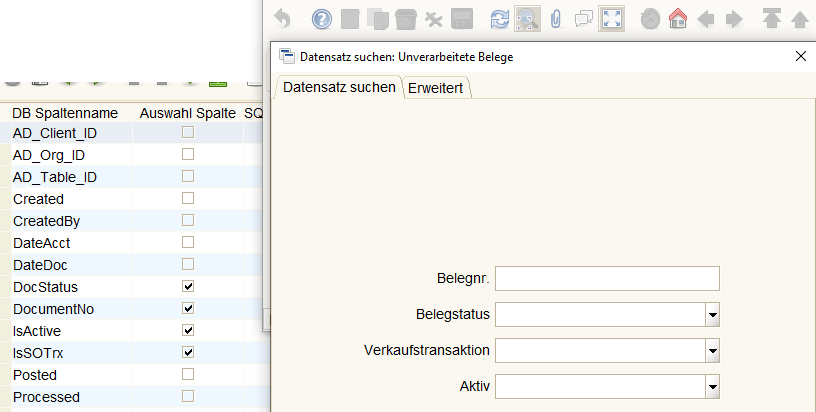

# Aufbau der Fenster

### Allgemeines zu Handhabung von Fensterelementen

siehe dazu [wikipedia Fenster (Computer)](https://de.wikipedia.org/wiki/Fenster_%28Computer%29#Fensterelemente_und_Handhabung)

### Toolbar

Die [Toolbar](https://wiki.idempiere.org/de/Toolbar) erscheint in *Dempiere am oberen Rand der meisten Fenster.

#### Suche

`<F6>` oder  (Datensatz suchen) öffnet einen Suchdialog, in dem Suchkriterien eingegeben werden. Die erweiterte Suche ist immer möglich, sie erfordert etwas know-how über die Datenstruktur. In der einfachen Suche sind bereits [Kriterien vordefiniert](../adm/3.UIanpassen.md#suche-konfigurieren). Beispiel:

