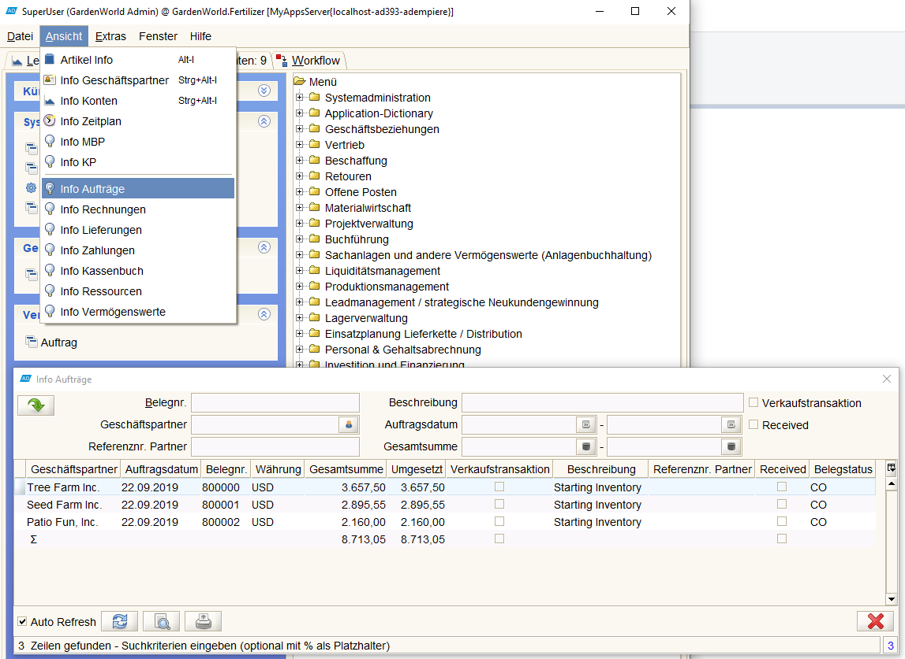
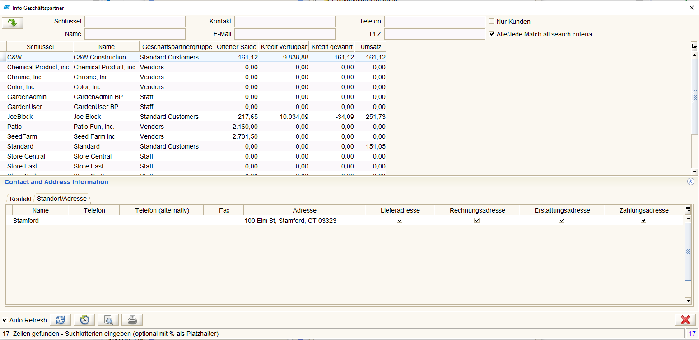
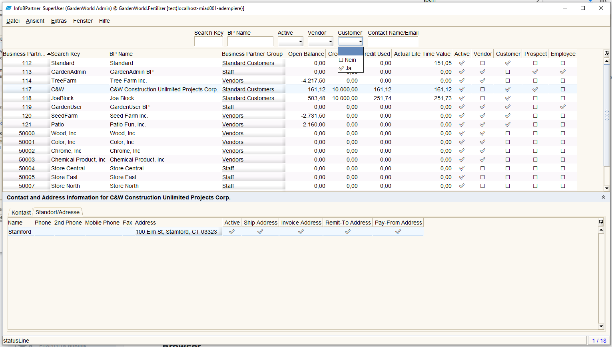

# Aufbau der Fenster

## Allgemeines zu Handhabung von Fensterelementen

siehe dazu [wikipedia Fenster (Computer)](https://de.wikipedia.org/wiki/Fenster_%28Computer%29#Fensterelemente_und_Handhabung)

## Menu

## Transaktionsfenster

## Formularfenster

## Infofenster

Es gibt 13 Infofenster mit Datenauswahl and -anzeige. Im Gegensatz zu Transaktionsfenster sind die Inhalte nicht konfigurierbar sondern wie bei Formularen fest programmiert. Die Infofenster sind aus der Toolbar aufrufbar. Beispiel Info Aufträge:

### Info Geschäftspartner

Am Beispiel Info Geschäftspartner will ich zeigen, dass es generische Alternativen zu den fest verdrahteten Infofenster gibt. So sieht es im Original aus: 

* die Zellen der Tabellen können nur gelesen werden, ein drill-down-zoom z.B zu den Daten des GP oder zur Adresse ist nicht vorgesehen
* es werden entweder alle Geschäftspartner (⬜ nur Kunden) angezeigt oder ✅ nur die Kunden. Anzeigen von Lieferanten, Mitarbeitern oder Interessenten ist nicht vorgesehen. Genauso nicht möglich "welche Geschäftspartner sind Kunden und Lieferanten?"
* Suche nach Name ist technisch auf eine Spalten der DB-Tabelle orientiert. Tatsächlich werden aber die BP Namen in zwei Spalten abgelegt, `Name` und `Name2`. Gesucht wird nur in Name. Die Suche nach "unlimited" bleibt daher erfolglos.
* ähnlich verhält sich mit der Suche nach Kontakten oder Telefon
* der grosse Nachteil ist aber die fehlende Flexibilität. Jede Layoutänderung, Hinzufügen von Suchkriterien muss programmiert werden.
 
Und so sieht eine Alternative aus. Bewusst ist das Layout ähnlich gehalten.
* das Layout (Spalten der Tabelle) ist konfigurierbar, Spalten hinzu oder wegnehmen, die Reihenfolge ändern, ist ohne Programmänderung möglich
* auch die Suchkriterien sind konfigurierbar
* `BP Name` ist aus `Name` und `Name2` zusammengesetzt, gesucht wird in beiden
* die Suchkriterien für [Yes-No](../adm/datatype.md#yes-no) sind 3-wertig, so kann man "alle" GP, die Kunden und die nicht Kunden finden. Die Frage _welche Geschäftspartner sind Kunden und Lieferanten?_ ist beantwortet. Es sind 3.
* weitere Tabs im unteren Pane mit Aufträgen, Lieferscheinen, Rechnungen usw lassen sich leicht einfügen

## Browser

## Report

## Workflow

## Prozess

### Toolbar

Die [Toolbar](https://wiki.idempiere.org/de/Toolbar) erscheint in *Dempiere am oberen Rand der meisten Fenster.

#### Suche

`<F6>` oder  (Datensatz suchen) öffnet einen Suchdialog, in dem Suchkriterien eingegeben werden. Die erweiterte Suche ist immer möglich, sie erfordert etwas know-how über die Datenstruktur. In der einfachen Suche sind bereits [Kriterien vordefiniert](../adm/3.UIanpassen.md#suche-konfigurieren). Beispiel:

