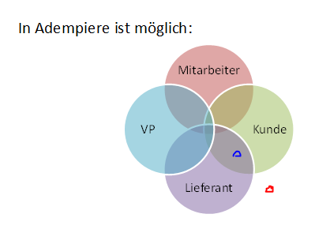
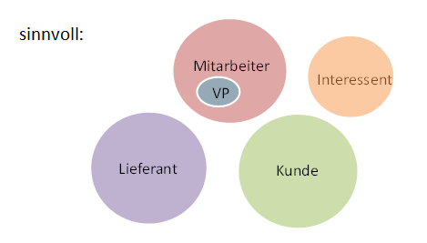

# Geschäftsbeziehungen

## Geschäftspartner

Es geht hier auch um die Begriffe Kreditoren/Lieferanten und Debitoren/Kunden. In DATEV bzw. im Kontenrahmen (z.B. SKR03) [müssen Personenkonten bestimmte Nummernkreise belegen](../usr/3.datev.md#suchschluessel-fuer-geschaeftspartner). ADempiere dagegen verfolgt den Geschäftspartner/"Business Partner"/BP Ansatz: ein BP kann 
* Kunde `c_bpartner.IsCustomer`
* Lieferant `c_bpartner.IsVendor`
* oder Beides oder auch "keines von Beiden" sein  
* Außerdem gibt es die Attribute
* `c_bpartner.IsEmployee` für Mitarbeiter
* `c_bpartner.IsSalesrep` für Vertriebspartner/Kundenbetreuer
* `c_bpartner.IsOnetime` für "Laufkundschaft"
* `c_bpartner.IsProspect` für CRM:"Interessent"
* `c_bpartner.IsManufacturer`

Beispiel

* ein BP (rot) ist weder Kunde noch Lieferant, in DATEV sind solche BP nicht vorgesehen
* ein BP (blau) ist beides, Kunde und Lieferant - Problem: welche DATEV Kontonr? - nicht DATEV konform!
* ich spare mir den Kommentar zur den sonstigen Konstallationen 
* im Bild habe ich wegen Übersichtlichkeit `IsOnetime`, `IsProspect`, `IsManufacturer` weggelassen.

Derzeit gibt es kein Regelwerk, keine AD-validatoren, die DATEV-Regeln prüfen. Ein DATEV-kompatibles Modell könnte so aussehen

* Kunden, Lieferanten, Interessenten und Mitarbeiter bilden disjunkte Mengen
* Vertriebspartner ist Untermenge von Mitarbeiter (es gibt keine "externe" VP)
* `IsOnetime`, `IsManufacturer` wird nicht genutzt 