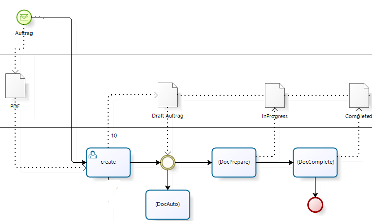
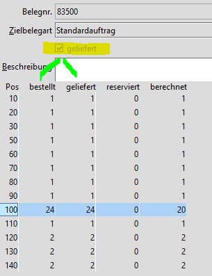
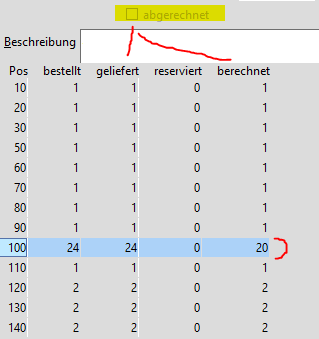

# Vertriebsprozess

Der Vertreibsprozess beginnt nicht immer mit einem Auftrag. Die Auftraggeber müssen erst gewonnen werden. Oft ist dem Auftrag ein Angebot vorangestellt.

In Adempiere spiegelt sich der Ablauf im Menüpunkt "Marketing und Vertrieb". Ein Angebot wird ähnlich wie ein Auftrag erstellt und befindet sich daher im Menü "Aufträge"

## Angebotserstellung

Beispiel: Sie erfassen ein "Angebot" an einen Geschäftspartner über die Lieferung einer Gartensitzgruppe samt Sonnenschirm:

### vom Angebot zum Auftrag

Wie alle Belege unterliegt das Angebot und ein Auftrag einem [Standardworkflow](2.bprocess+menu.md#geschaeftsprozess-als-workflow). Typischerweise ist ein Angebot befristet: Der Beleg verweilt nach dem Erstellen im Status "InProcess" solange bis die Angebotsfrist abgelaufen ist oder bis der potentielle Kunde es annimmt. Aber wie wird aus einem Angebot ein Auftrag?

Dazu gibt es zwei Möglichkeiten:

* man ändert die Belegart. Die ist der natürliche Übergang. Aus dem Angebot wird ein Auftrag. Alle Daten, Attribute und Anhänge werden in den Auftrag übernommen. Damit Artikel reserviert werden, muss der Auftrag "in Bearbeitung" gesetzt werden (Vorbereiten/DocPrepare).
* durch den Prozess Konvertieren/Kopieren. Dabei bleibt das Angebot bestehen. Die Grunddaten werden in einen neuen Auftrag kopiert. 

## Auftragsannahme

Akzeptiert der Kunde das Angebot, so können Sie das "Angebot" in einen "Auftrag" umwandeln. Damit entfällt eine wiederholte Erfassung. Der Auftrag kann vor der Fertigstellung modifiziert werden:

Im Beispiel ist die Lieferadresse gleich der Rechnungsadresse. 

### manuelle Auftragannahme

* der Auftrag kommt als pdf per mail (Auftragseingang) 
* der Sachbearbeiter erfasst den Auftrag (10),  
* die Auftragspositionen müssen abgetippt werden, Liefer- und Zahlungspartner eingetragen und die Konditionen festgehalten 
* ... und stellt ihn fertig (COmpleted) 

### automatisierte Auftragannahme

* der Auftrag wird direkt aus einer Outlook-mail erzeugt 
* der Sachbearbeiter kann den Auftrag prüfen und bei Bedarf anpassen
* bevor er ihn fertigstellt

### Auftrag vorbereiten - Reservieren der Artikel

Beim Vorbereiten werden alle Artikel mit der gewünschten Menge reserviert. Die Reservierung wird erst mit der Lieferung aufgehoben. In der ProductInfoanzeige sieht man die Reservierungen zu jedem Artikel.

## Lieferung

Aus dem Auftrag kann der Lieferschein für den Warenausgang und die Rechnung generiert werden. Nicht immer ist die Lieferadresse gleich der Rechnungsadresse. Geliefert wird an den Geschäftspartner "Michael E.", die Rechnung geht an den Rechnungspartner. 

Für die Belege können verschiedene Nummernkreise definiert werden.

### Lieferung mit Bestaetigung

* die (Kunden)-Bestätigung ist eine optionale Ablaufkomponente im Adempiere
* sie ist als Empfangsbestätigung für den Versand gedacht, "der Kunde bestätigt, dass die Ware geliefert wurde"
* die Positionen entsprechen denen des Lieferscheins
* die Bestätigung hat keinen Einfuss auf den "Fertigstellung"s Status des Lieferscheins , => Auftrag wurde ausgeliefert , => Rechnung kann erzeugt werden 

## Rechnungsstellung

Das Drucken von Angeboten, Aufträgen, Lieferscheinen und Rechnungen ist einheitlich. Aus der Rechnungsvorschau wird ein PDF erstellt, das gedruckt oder per Mail verschickt werden kann. 
Per Zoom-Across kann aus der Rechnung der zugehörige Lieferschein und der Auftrag gefunden werden. 

### vom Auftrag zur Rechnung

Es gibt mehrere Wege, aus Aufträgen Lieferscheine und Rechnungen zu erstellen:

1. aus fertiggestelltem Auftrag zuerst nur den Lieferschein erzeugen
1. aus fertiggestelltem Auftrag beides, den Lieferschein und die Rechnung erzeugen
1. aus fertiggestelltem Auftrag nur die Rechnung erzeugen
1. die Rechnung aus einem zuvor fertiggestellten Lieferschein erzeugen
 

### bestellt - geliefert - berechnet - Auftrag abschliessen

Über das Reservieren von bestellten Artikeln eines Auftrags wurde bereits oben geschrieben. Zwei Indikatoren zeigen den Prozessfortschritt eines Auftrags an. Hier ein Beispiel.

* **geliefert** zeigt an, dass alle Positionen des Auftrags vollständig geliefert sind, dh bei Auftrag 83500: JA

* **abgerechnet** zeigt an, dass Lieferungen des Auftrags vollständig in Rechnung gestellt wurden, dh heißt bei Auftrag 83500: NEIN, denn 4h der  Positien 100 wurden nicht abgerechnet.

Wie kann man den Auftrag **geliefert** und **abgerechnet** bekommen?

1. da tatsächlich nur 20h erbracht wurden, einen weiteren Lieferschen über -4h nachtragen
1. damit sind die Lieferungen vollständig **abgerechnet**. Aber der Auftrag gilt nun als nicht vollständig geliefert!
1. Jeder fertiggestellte Auftrag kann geschlossen werden. Mit dem Schliessen des Auftrags werden die nicht gelieferten Positionan "glattgestellt". Der Auftrag ist jetzt vollständig **geliefert** und **abgerechnet**

## Zahlungsverfolgung

Die Zahlungsverfolgung ist im Menu unter "Offene Posten" untergebracht. Dort können Eingangszahlungen erfaßt und den Rechnungen zugeordnet werden werden.

