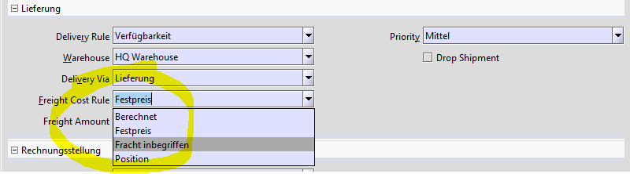

# Frachtkostenberechnung

TODO

Es gibt mehrere Regeln für die Berechnung. Einige Regeln sind fest: **Calculated**/C und **Freight included**/I wurden durch Adaxa beschrieben. Diese Liste kann ergänzt werden, siehe P, es erfordert eine zusätzliche Programmierung.  

**_Regel_**        | **_FREIGHTCOSTRULE_**  | **_Beschreibung_**
------------------ | ---------------------- | ------- 
Berechnet          | **Calculated**/C       | Calculated based on Product Freight Rule 
Festpreis          | Fix price/F            | Fixed freight price
Fracht inbegriffen | **Freight included**/I | Freight cost included (default)
Position           | Line/L                 | Entered at Line level / Die Kosten werden als Zeile im Auftrag andegeben
Pauschal           | Flat charge/P          | Versandkostenpauschale / metas in Adempiere 3.5.4a mit zusätzlichen Tabellen, nicht in AD3.9.x

