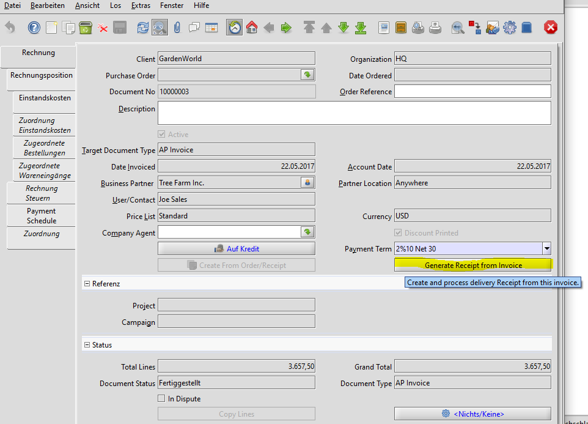

# Beschaffungsprozess/Einkauf

Es gibt eine Symetrie zwischen Vertriebsprozess und Beschaffungsprozess:

Diese Symetrie vereifacht das Datenmodell. Es gibt nur ein Order- und ein Rechnungsobjekt. Ein Auftrag ist eine eingehende Order (sales order) vom Kunden, eine Bestellung ist eine ausgehende Order an einen Lieferanten (purchase order). Ähnliches gilt für Rechnungen (Ausgangsrechnung und Eingangsrechnung), für Zahlungen und Warenbewegungen. Lediglich die Transaktionsart (sales vs purchase transaction) unterscheidet die Objekte.

Eine andere Darstellung der Symetrie findet man bei [Jairah](http://wiki.adempiere.net/User:Jairah#ADempiere_Transaction_Flow_with_Accounting_Postings)

Allerdings spiegelt sich diese Symetrie nicht im Adempiere Menü "Beschaffung" wieder:

 

Manchmal ist der Vertriebsprozess mit dem Beschaffungsprozess verzahnt. Ware wird erst nach Auftragseingang bestellt. Das verzögert die Auslieferung an den Kunden, aber es minimiert die Lagerkosten. Oft findet man eine Kombination. Häufig benötigte Ware wird in Chargen bestellt oder produziert und zwischengelagert. Andere Artikel werden erst bei Auftragseingang hergestellt (make-to-order). 

Eine andere Variante ist das [Streckengeschäft](4.opentrans.md).

## Bestellung

vorerst siehe "http://wiki.idempiere.org/de/Bestellung_(Fenster_ID-181%29"

### Direktlieferung (Streckengeschäft)

Bei einer Direktlieferung/"Drop Shipment" liefert der Lieferant/Hersteller direkt an den Kunden. Eine Direktlieferung verursacht weder Reservierungen noch Lagerbewegungen, da die Lieferung direkt aus dem Lager eines Lieferanten erfolgt. 

Der Wareneingang beim Kunden muss bestätigt werden. 

Es ist üblich, dass der Lieferant den Besteller über die erfolgte Lieferung mittels einen Lieferavis informiert. Aus diesem Avis kann der Wareneingang erfasst werden, da der Kunde den Wareneingang im ADempiere ja nicht erfassen kann.

Zum Ablauf eines Streckengeschäft siehe [wikipedia](https://de.wikipedia.org/wiki/Streckengesch%C3%A4ft#Ablauf)

## Wareneingang

Der Wareneingang (besser: WE-Empfangsbestätigung) kann aus einer Bestellung generiert werden

Oft bekommt man mit dem Wareneingang auch die Rechnung. Dann kann man die Empfangsbestätigung aus der Rechnung erstellen:

