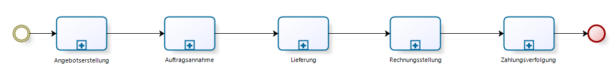
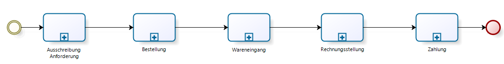
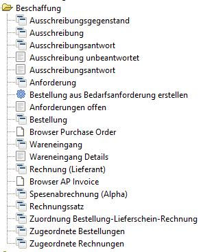
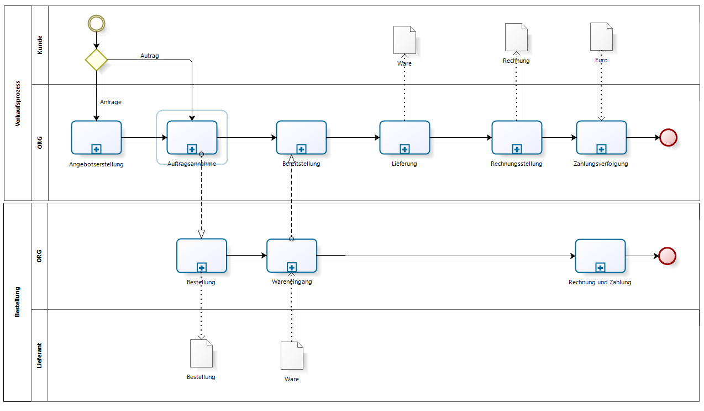
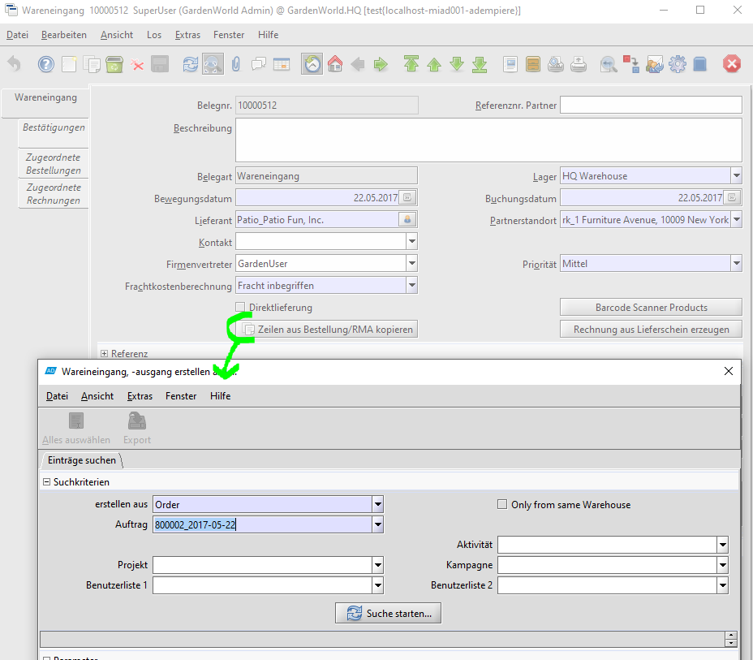

# Beschaffungsprozess/Einkauf

Es gibt eine Symetrie zwischen Vertriebsprozess und Beschaffungsprozess:

Diese Symetrie vereifacht das Datenmodell. Es gibt nur ein Order- und ein Rechnungsobjekt. Ein Auftrag ist eine eingehende Order (sales order) vom Kunden, eine Bestellung ist eine ausgehende Order an einen Lieferanten (purchase order). Ähnliches gilt für Rechnungen (Ausgangsrechnung und Eingangsrechnung), für Zahlungen und Warenbewegungen. Lediglich die Transaktionsart (sales vs purchase transaction) unterscheidet die Objekte.

Allerdings spiegelt sich diese Symetrie nicht im Adempiere Menü "Beschaffung" wieder:

 

Manchmal ist der Vertriebsprozess mit dem Beschaffungsprozess verzahnt. Ware wird erst nach Auftragseingang bestellt. Das verzögert die Auslieferung an den Kunden, aber es minimiert die Lagerkosten. Oft findet man eine Kombination. Häufig benötigte Ware wird in Chargen bestellt oder produziert und zwischengelagert. Andere Artikel werden erst bei Auftragseingang hergestellt (make-to-order). 

Eine andere Variante ist das [Streckengeschäft](4.opentrans.md).

## Bestellung

vorerst siehe [idempiere](http://wiki.idempiere.org/de/Bestellung_(Fenster_ID-181))

## Wareneingang

Der Wareneingang kann aus einer Bestellung generiert werden

