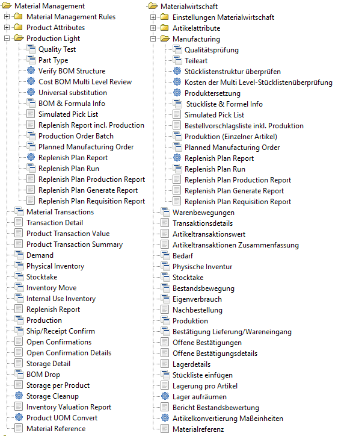
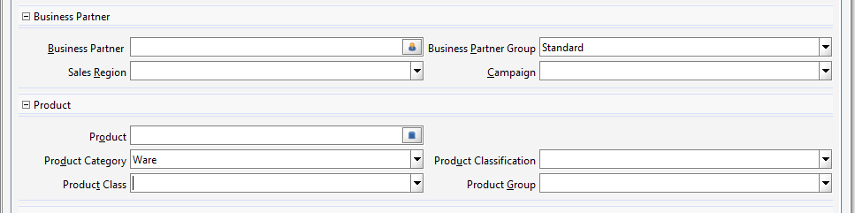

# Warenwirtschaft/Logistik

Fenster und Prozesse zu diesem Thema findet man unter Material Management/Materialwirtschaft und Warehouse Management.

## Artikelstamm

Die Artikelstammdaten sind ein zentrales und umfangreiches Thema [siehe hier compiere(en)](http://wiki.compiere.com/display/docs/Products)

Neben der Namensgebung und den Attributen (z.B. Artikeltyp) gibt es mehrere Möglichkeiten, Produkte/Artikel hierarchisch zu unterteilen:
* Kategorie
* Klasse
* Klassifikation
* Gruppen

Adempiere legt nicht fest, was unter den Begriffen zu verstehen ist.

### Artikeltyp

Dieses Attribut ist fest definiert, [link(en)](https://adempiere.gitbook.io/docs/introduction/products-and-material-management/product-setup/defining-the-product/product-types). Es gibt:

**_Artikeltyp_** | **_Product Type_** | **_Beschreibung_**
---------------- | ------------------ | ------- 
Ware             | Item/I             | physische Güter, die man verkauft
Hilfsmittel      | Resource/R         | Resourcen werden benötigt aber nicht direkt verkauft. Sie sind beschränkt verfügbar. Beispiel: Sie verkaufen "gegrillte Würstchen", die Resource ist die Grillkohle
Dienstleistung   | Service/S          | im Gegensatz zur Hilfsmittel sind Dienstleistungen unbeschränkt verfügbar, Haareschneiden wird nie alla 
Aufwand          | ExpenseType/E      | diverser Aufwand der extra berechnet wird, kommt der Frisuer zu Ihnen, so wird er die Anfahrt extra berechnen
Online           | Online/O           | online verfügbar

## Production light

Dieser Teil von Adempiere gehört eigentlich unter Manufacturing. Die Komponenten wurden ursprünglich von der [Fa.Adaxa unter dem Namen Manufacturing light](https://www.adaxa.com/wp-content/uploads/HowToPDF/ManufacturingLight.pdf) bereitgestellt.

## Produktion

[aus Compiere (en)](http://wiki.compiere.com/display/docs/Material+Management) - Production is generally used to create kits or baskets of products that do not require any resources. For example, you may sell chairs, tables and sun umbrellas as separate products and also sell a Patio Set. These Patio Sets are simply 4 chairs, 1 table and 1 umbrella. There is no manufacturing or assembly required. There is also little or no delay from when the individual items are moved as single items from stock and moved back into stock as the finished Bill of Materials. If there were a delay or some type of resource or other asset were required (e.g. machine time or machinist) then it would more appropriate to use the Manufacturing Module.
