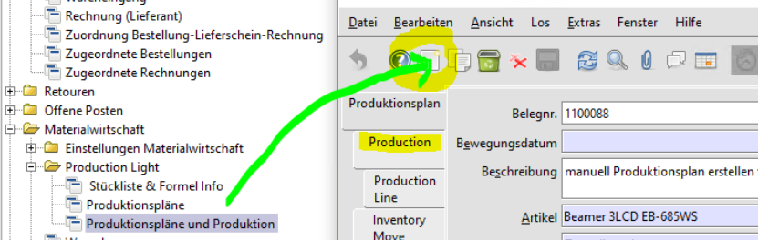

# Warenwirtschaft/Logistik

Fenster und Prozesse zu diesem Thema findet man unter Material Management/Materialwirtschaft und Warehouse Management.

## Artikelstamm

Die Artikelstammdaten sind ein zentrales und umfangreiches Thema [siehe hier compiere(en)](http://wiki.compiere.com/display/docs/Products)

Neben der Namensgebung und den Attributen (z.B. Artikeltyp) gibt es mehrere Möglichkeiten, Produkte/Artikel hierarchisch zu unterteilen:
* Kategorie
* Klasse
* Klassifikation
* Gruppen

Adempiere legt nicht fest, was unter den Begriffen zu verstehen ist.

### Artikeltyp

Dieses Attribut ist fest definiert, [link(en)](https://adempiere.gitbook.io/docs/introduction/products-and-material-management/product-setup/defining-the-product/product-types). Ursprünglich ([compiere](http://wiki.compiere.com/display/docs/Products)) gab es nur zwei Typen, **Item** und **Service**. Ein paar Typen sind inzwischen dazugekommen :

**_Artikeltyp_** | **_Product Type_** | **_Beschreibung_**
---------------- | ------------------ | ------- 
Ware             | **Item**/I         | physische Güter, die man verkauft
Hilfsmittel      | Resource/R         | Resourcen werden benötigt aber nicht direkt verkauft. Sie sind beschränkt verfügbar. Beispiel: Sie verkaufen "gegrillte Würstchen", die Resource ist die Grillkohle. Die Übersetzung Hilfsmittel ist irreführend, denn auch ein Handwerkertermin ist eine beschränke Resource
Dienstleistung   | **Service**/S      | im Gegensatz zur Resourcen sind Services unbeschränkt verfügbar. Auch hier ist die Übersetzung problematisch. Haareschneiden ist eine Dienstleistung, der Termin beim Frisör ist aber beschränkt. Der Begriff _Dienstleistung_ hat auch einen steuerlichen Aspekt.
Aufwand          | ExpenseType/E      | diverser Aufwand, der extra berechnet wird. Kommt der Frisuer zu Ihnen, so wird er die Anfahrt extra berechnen
Online           | Online/O           | online verfügbar

### Produktinfo

In dieser Anzeige wird zu jedem Artikel der Lagerbestand pro Lager, die Bestellungen und die [Reservierungen](2.3-sales.md#auftrag-vorbereiten-reservieren-der-artikel) angezeigt

## Production light

Dieser Teil von Adempiere gehört eigentlich unter [Manufacturing](2.6-prod.md). Die Komponenten wurden ursprünglich von der [Fa.Adaxa unter dem Namen Manufacturing light](https://www.adaxa.com/wp-content/uploads/HowToPDF/ManufacturingLight.pdf) bereitgestellt.

 

- erstellen eines Produktionsplans (Bild oben)
- Produktion - Zusammenstellen von mehrere Einzelkomponenten (gemäß Stückliste) zu einem Produkt
