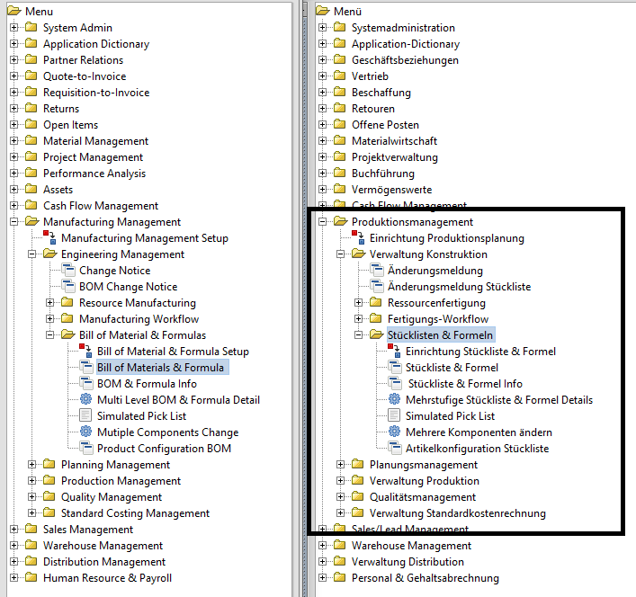
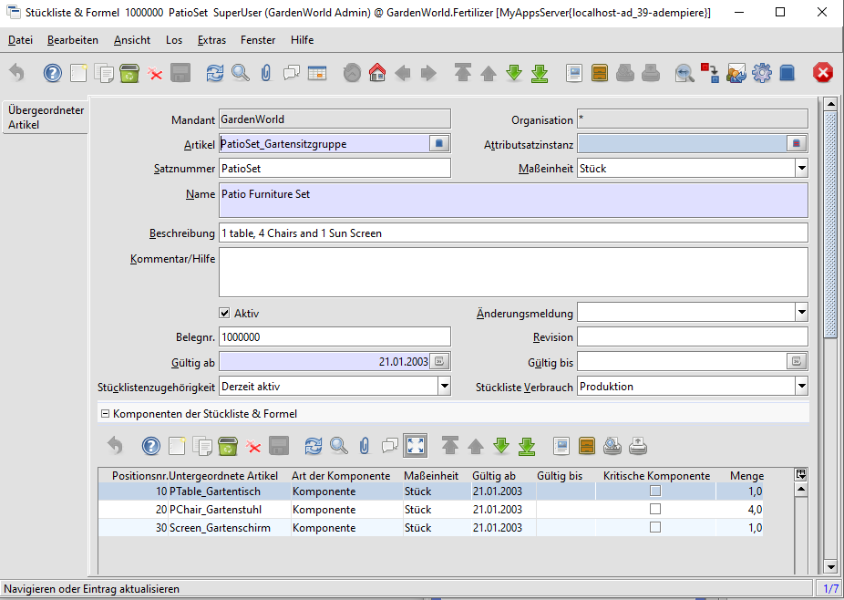
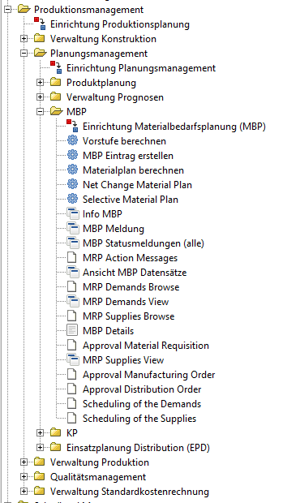

# Produktion

[aus Compiere (en)](http://wiki.compiere.com/display/docs/Material+Management) - Production is generally used to create kits or baskets of products that do not require any resources. For example, you may sell chairs, tables and sun umbrellas as separate products and also sell a Patio Set. These Patio Sets are simply 4 chairs, 1 table and 1 umbrella. There is no manufacturing or assembly required. There is also little or no delay from when the individual items are moved as single items from stock and moved back into stock as the finished Bill of Materials. If there were a delay or some type of resource or other asset were required (e.g. machine time or machinist) then it would more appropriate to use the Manufacturing Module.

TODO

## Production light

siehe unter [Warenwirtschaft/Logistik](2.5-mm.md#production-light).

## Stücklisten/[BOM](https://de.wikipedia.org/wiki/St%C3%BCckliste)

Stücklisten für Baupläne werden meist hierarchisch dargestellt, seltener sind die [Gozintograph](https://de.wikipedia.org/wiki/Gozintograph)en

Bauplan | hierarchisch | Gozinto 
------- | ------- | -------
 |  | 

Beispiel: eine Gartensitzgruppe besteht aus einem Tisch, vier Stühlen und einem Sonnenschirm 
* die Komponenten kann man möglicherweise auch einzeln erwerben
* die Summe der Einzelpreise ist üblicherweisen nicht der Preis für die Gartensitzgruppe

Im Beispiel ist keines der Komponenten kritisch. Aus meiner Sicht ist das nicht korrekt, denn es bedeutet, dass eine Gartensitzgruppe auch ohne der Komonenten verkauft werden kann. Ich würde daher alle drei Bestandteile als kritisch markieren.

Retrograde Entnahme/[backflushing](http://www.businessdictionary.com/definition/backflushing.html): 
ist eine technischer Ausdruck aus Warenwirtschaftssystemen. Ein Artikel/Gartensitzgruppe wird aus einer Stückliste zusammengebaut/zusammengestellt. Am Ende der Produktion werden durch den Buchungsprozess die Einzelteile in der definierten Menge vom Lager genommen und stattdessen das Fertigteil zugebucht. 

## Materialbedarfsplanung (MBP) / Material Requirements Planning (MRP) 

