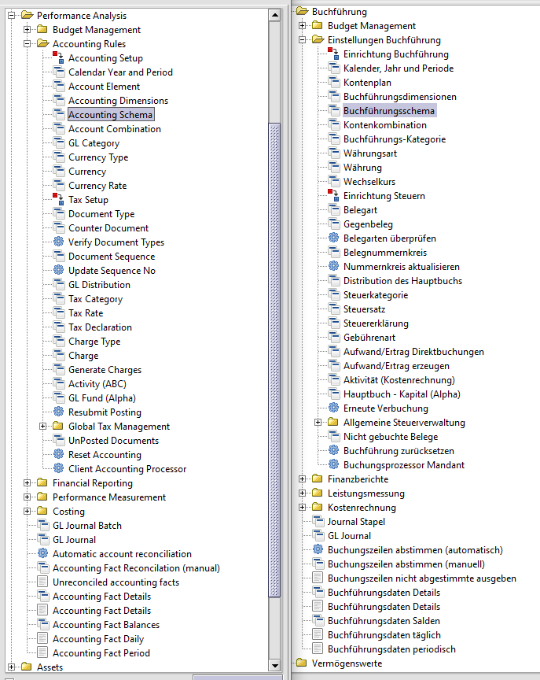
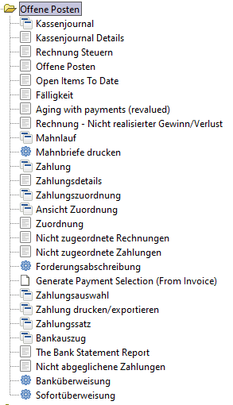

# Rechnungswesen/Buchführung

Buchführung vs Buchhaltung

[Buchführung](https://de.wikipedia.org/wiki/Buchf%C3%BChrung) bezeichnet die in Zahlenwerten vorgenommene Aufzeichnung von Geschäftsvorgängen. [Buchhaltung](https://de.wikipedia.org/wiki/Buchhaltung) ist die Organisationseinheit eines Unternehmens, die sich mit der Buchführung befasst. Häufig werden die Begriffe Buchhaltung und Buchführung als Tätigkeit synonym verwendet.
[Rechnungswesen](https://de.wikipedia.org/wiki/Rechnungswesen) ist ein umfassendere Begriff zur Buchführung.

Das Benutzermenü in Adempiere hat einen Abschnitt für die "Einstellung der Buchführung":

Die zentralen Punkte bei der Einstellung sind
* die Definition eines Buchungskalenders für die Geschäftsjahre mit Buchungsperioden
* der Kontenplan, also ein Kontorahmen
* das Buchführungsschema mit Dimensionen und Zuordnung der [Basiskonten](http://wiki.idempiere.org/de/Basiskonten) zum gewählten Kontenplan
* die Buchführungskategorien
* Festlegen der Belegnummernkreise
* und die Belegarten

Die [AD-Buchungsmaschine/Accounting](http://wiki.idempiere.org/en/IDempiere_Accounting) arbeitet mit "abstrakten" [Basiskonten](http://wiki.idempiere.org/de/Basiskonten), die einem realen Kontenplan, z.B. SKR03 zugeordnet werden. Es gibt zwei feste Dimensionen "Organisation" und "Konto" und weitere optionale für Vertriebsgebiet, Aktivität, Projekt, Geschäftspartner, Artikel und Kampagne.

Im [adempiere wiki (en)](http://wiki.adempiere.net/Chart_of_Accounts) befindet sich ein guter Artikel zum Thema Kontenplan und Buchungsmaschine.

Beispiel: ein Teil der [Zuordnung](http://wiki.idempiere.org/de/Buchf%C3%BChrungsschema_%28Fenster_ID-125%29#TAB:_Voreinstellungen) der Bank-Basiskonten zum Kontenplan sieht bei drei Dimensionen so aus:

Die [Dimensionen](http://wiki.idempiere.org/en/Accounting_Dimensions_%28Window_ID-283%29) werden durch ``-`` getrennt. Lesart: das Basiskonto ``b_asset_acct`` ist für alle ``*`` Organisationen dem Konto ``1200`` zugeordent. Es gibt 83 solcher Kontenkombinationen. Die Kombinationen werden beim [Einrichten eines Mandanten](../adm/1.installation.md#einrichtung-eines-mandanten-mit-standard-kontenrahmen) automatisch erstellt.

Mittelständige Organisationen verzichten oft auf eine Buchhaltung und lassen die Buchführung oder Teile davon (Finanzbuchhaltung) von [externen](https://forum.metasfresh.org/t/bestellung-wareneingang-ent-karottisieren-kein-gemuese/479/6) Unternehmen ([Steuerberater](https://de.wikipedia.org/wiki/Steuerberater)) durchführen. Diese nutzen die [DATEV](https://de.wikipedia.org/wiki/DATEV)-Buchführungssoftware. Dementsprechend steht DATEV auch als Synonym für einen deutschen Standard in der Buchführung.

## Teilbereiche der Buchhaltung

### Finanzbuchhaltung

Die [Finanzbuchhaltung](https://de.wikipedia.org/wiki/Finanzbuchhaltung) bucht Vorgänge, die zur Bilanzierung und zur Gewinn- und Verlustrechnung notwendig sind. 
Ein Teilbereich der Finanzbuchführung ist die [Kontokorrentbuchführung](https://de.wikipedia.org/wiki/Konto#Kontokorrent), die oft unterteilt wird in  
* die [Debitorenbuchhaltung](https://de.wikipedia.org/wiki/Debitorenbuchhaltung): verarbeitet die Forderungen an Kunden
* und die [Kreditorenbuchhaltung](https://de.wikipedia.org/wiki/Kreditorenbuchhaltung), welche die Verbindlichkeiten gegenüber Lieferanten bearbeitet

Oft wird die Finanzbuchhaltung ausgelagert und mit DATEV-Software verarbeitet

## Bücher der Buchführung

Die Buchführung besteht eigentlich aus mehrere Büchern [Grundbuch, Hauptbuch und Nebenbücher](https://de.wikipedia.org/wiki/Buchf%C3%BChrung#B%C3%BCcher). Dieser Zusammenhang gerät durch die Automatisierung in den Hintergrund. Das Verständnis wird aber wesentlich erleichtert, wenn man sich mit alten Vordrucken für Journal (Grundbuch) und Hauptbuch beschäftigt.

### Grundbuch

Dsa Grundbuch, oder Journal bzw. Tagebuch / [(en.wikipedia) journals](https://en.wikipedia.org/wiki/Special_journals) ist eine Aufzeichnung aller Geschäftsvorfälle in zeitlicher Reihenfolge:
* Eröffnungsbuchungen
* Laufende Buchungen
* Vorbereitende Abschlussbuchungen
* Abschlussbuchungen 

Grundsatz: zu jeder Buchung gibt es einen Beleg!

### Hauptbuch

[(en.wikipedia) general ledger](https://en.wikipedia.org/wiki/General_ledger) 

Jede Buchung im Grundbuch muss auf das entsprechende __Sachkonto__ des Hauptbuches übertragen werden. Die Übertragung geschieht automatisch. Daher wird nur noch das Grundbuch geführt. Im Hauptbuch ergibt sich eine sachliche Ordnung aller Buchungen auf Bestands- und Erfolgskonten. Das Hauptbuch besteht damit aus den im Kontenplan verzeichneten Sachkonten. Es gibt auch Sammelkonten, die in Nebenbüchern detailiert werden. Beispiele für Sammelkonto:  

* SKR03 Konto 1400 "Forderungen aus Lieferungen und Leistungen" ist ein Sammelkonto für Debitorenrechnungen (Ausgangsrechnungen)
* SKR03 Konto 1600 "Verbindlichkeiten aus Lieferungen und Leistungen" ist ein Sammelkonto für Kreditorennrechnungen (Eingangsrechnungen) 

__Sammelkonto__ : Konto der Hauptbuchführung, für die eine Nebenbuchhaltung mit Nebenkonten existiert.

### Nebenbücher

[(en.wikipedia) subledger](https://en.wikipedia.org/wiki/Subledger)

* Kontokorrentkonten : hier wird der Geschäftsverkehr mit den Kunden (Debitoren) und Lieferanten (Kreditoren) erfasst. Man spricht auch von der Kreditoren- und Debitorenbuchhaltung (oder Offene-Posten-Buchhaltung). Frühere Namen waren Buch der Geschäftsfreunde bzw. Personenbuch, daher der Begriff Personenkonten. siehe auch: [Zusammenhang zwischen Sachkonten und Personenkonten](https://www.rechnungswesen-info.de/personenkonten.html)

* Lohn- und Gehaltsbücher : hier wird die Lohn- und Gehaltsabrechnung vorgenommen

* Lagerbücher/Lagerkartei : hier werden die Aufzeichnungen über die Bestände, Zugänge und Abgänge der Lagerpositionen erfasst

* Anlagenbücher/Anlagenkartei: Hier werden die Veränderungen im Anlagevermögen (Zugänge, Abschreibungen und Abgänge) erfasst

* das Bankbuch, Wechselbuch und das [Kassenbuch](https://de.wikipedia.org/wiki/Kassenbuch) (wir manchmal als Hilfsbuch bezeichnet) 

## [Offene Posten](https://de.wikipedia.org/wiki/Offener_Posten)

Im [ADempiere Menü](2.bprocess+menu.md) sucht man vergeblich nach den Begriffen Finanz-, Debitoren- oder Kreditorenbuchhaltung. Die Funktionen dazu findet man unter **Offene Posten**

## Anlagenbuchhaltung
  
Die [Anlagenbuchhaltung](https://de.wikipedia.org/wiki/Anlagenbuchhaltung) verwaltet Güter des Anlagevermögens

## Lohnbuchhaltung

Die [Lohnbuchhaltung](https://de.wikipedia.org/wiki/Lohnbuchhaltung) wickelt die Lohn- und Gehaltsabrechnungen ab.

## Kostenrechnung

Die [Kosten- und Leistungsrechnung](https://de.wikipedia.org/wiki/Kosten-_und_Leistungsrechnung) ordnet zu, welche Kosten die einzelnen Unternehmensteile oder Projekte verursachen.

## Lager- oder Mengenbuchhaltung

Die Lager- oder Mengenbuchhaltung ist für die Verbuchung von Geschäftsvorfällen in der [Materialwirtschaft](https://de.wikipedia.org/wiki/Materialwirtschaft) zuständig.
