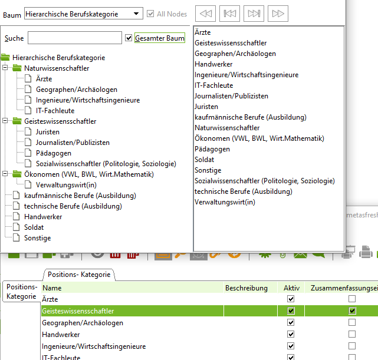

# Personal und Gehaltsabrechnung

TODO

## Berufskategorie

Bei der Systeminstallation sollte man die Referenztabellen `c_job` und `c_jobcategory` befüllen. Die Tabelle `c_jobcategory` läßt sich relativ einfach so erweitern, dass eine hierarchische Berufskategorie als Baum definiert werden kann. Etwa so:

Die Daten für jobcategory gibt als ISCO-88 Standard in drei Sprachen von der Internationalen Arbeitsorganisation (ILO), siehe [hier](http://wiki.idempiere.org/de/Positionskategorie_%28Fenster_ID-352%29#Berufskategorien).

Die Einordnung von job und jobcategory in das [Datenmodell/link](https://globalqss.com/idempiere/1.0c/schemaspy/OrgUser/relationships.html):

