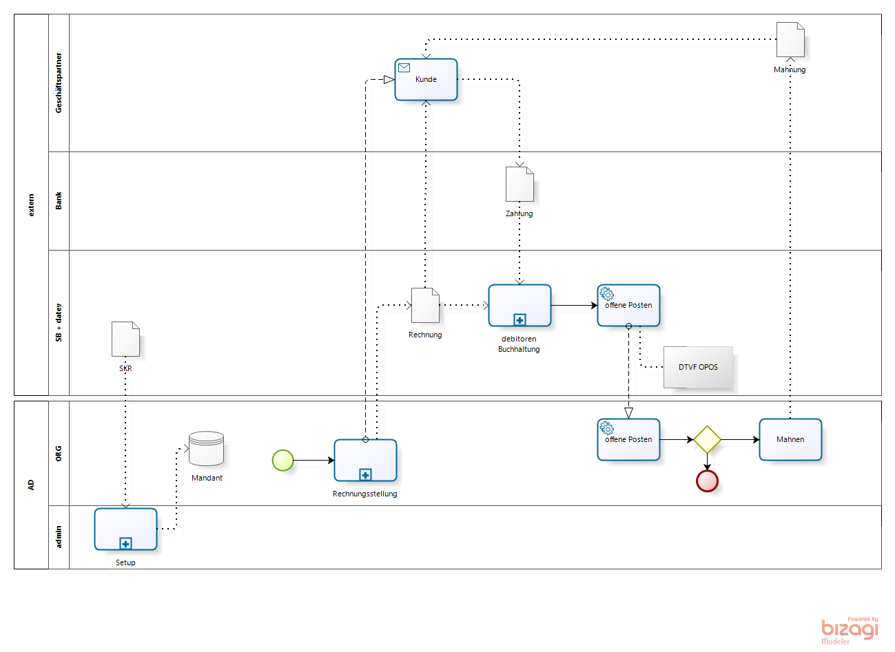
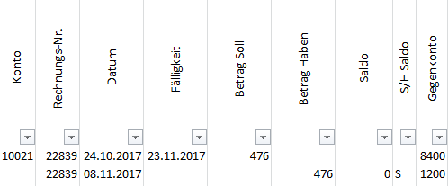
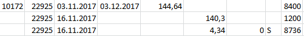
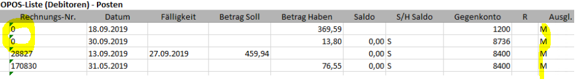
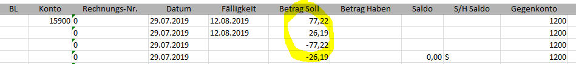
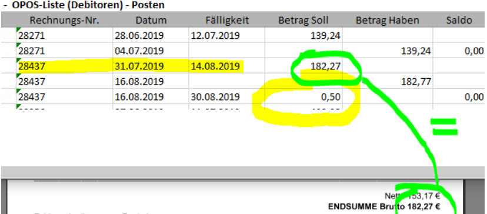

# Koexistenz mit DATEV

Mittelständige Organisationen verzichten oft auf eine Buchhaltung und lassen die [Buchführung](2.8-acc.md) extern durchführen. 
Der Grund für diese Entscheidung liegt in der Tatsache, daß es kaum [Buchhalter](https://de.wikipedia.org/wiki/Buchhalter) gibt, die sich mit *dempiere, auskennen. Und [Wirtschaftsprüfer](https://de.wikipedia.org/wiki/Wirtschaftspr%C3%BCfer) erst recht nicht. Da ist die Dominanz aus [Nürnberg](https://de.wikipedia.org/wiki/DATEV) und [Walldorf](https://de.wikipedia.org/wiki/SAP) zu groß. Schade eigentlich, denn in ADempiere ist die Buchführung inclusive.

Die Entscheidung, die Buchhaltung mit [DATEV](https://de.wikipedia.org/wiki/DATEV)-Buchführungssoftware durchzuführen, betrifft einige [Geschäftsprozesse](2.de-menu.md). Es fängt schon bei der Einrichtung eines Mandanten in ADempiere an. Die folgende Abbildung zeigt zwei Beispiele

* die Wahl eines Kontorahmens bei der Einrichtung eines Mandanten in ADempiere
* die Synchronisierung der debitoren Bewegungsdaten 

### Einrichtung eines Mandanten mit Standard-Kontenrahmen

Schon früh muss man sich für einen [Kontenrahmen](https://de.wikipedia.org/wiki/Kontenrahmen#Kontenklassenbeispiele) entscheiden. Was ist der [Unterschied zwischen SKR03 und SKR04](https://www.teialehrbuch.de/Kostenlose-Kurse/Rechnungswesen-mit-Beispielen-aus-Lexware-und-DATEV/11.5.2-Die-Kontenrahmen.html)? Kurz:

* SKR03 ist nach dem Prozessgliederungsprinzip aufgebaut
* SKR04 ist nach dem Abschlussgliederungsprinzip aufgebaut

### Suchschlüssel für Geschäftspartner

In beiden Kontenrahmen sind die [Hauptbuch/Sachkonten](https://de.wikipedia.org/wiki/Sachkonto) 4-stellig, für [Nebenbuch/Personen-, Kontokorrentkonten](http://wirtschaftslexikon.gabler.de/Archiv/10929/personenkonten-v7.html) werden folgende 5-stellige Nummerkreise vorgeschlagen:

    10000-69999 : Debitoren
    70000-99999 : Kreditoren

Dieser Vorschlag sieht nicht vor, dass ein Geschäftspartner gleichzeitig Kunde und Lieferant ist. In solchen Fällen werden zwei Konti eingerichtet.
Um Geschäftspartnerstammdaten in ADempiere und DATEV synchron zu halten, kann man den Nummer der Personenkontos als Suchschlüssel für einen ADempiere Geschäftspartner verwenden. Daraus folgt, dass auch in ADempiere zwei GP eingerichtet werden müssen, wenn ein Partner sowohl Kunde wie auch Lieferant ist.

### Stammdatenpflege

Mit der Entscheidung neben ADempiere eine weitere Buchführungssoftware zu nutzen, die ebenfalls Stammdaten benötigt, müssen die Geschäftspartnerstammdaten synchronisiert werden. Man sollte ein System zum Lead definieren. Ist ADempiere das Leadsystem, dann werden nach einem initalem Befüllen der Stammdaten ins DATEV die Veränderungen (Zugänge, Deaktivierungen und Änderungen) periodisch übertragen.

#### DTVF

DTVF steht für DaTeV-Format. Unter [diesem Link](https://www.datev.de/dnlexom/client/app/index.html#/document/1036228) findet man eine Beschreibung der DTVF ASCII-Dateien zum Export und Import von Stamm- und Bewegungsdaten in ein DATEV Rechnungswesen-Programm.

### Synchronisierung der debitoren Bewegungsdaten 

Die Abbildung oben zeigt die letzten Subprozesse vom [Vertriebsprozess](2.de-menu.md), die Rechnungstellung und Zahlungsverfolgung ist aufgezoomt. In der ADempiere Rechnungsstellung wird dem Kunden eine Rechnung zugestellt. 

Die [Finanzbuchhaltung und die Offene Posten Verwaltung](https://de.wikipedia.org/wiki/Debitorenbuchhaltung) wird extern via DATEV erledigt. Dafür müssen Rechnung, Rechnungsdaten dem Steuerberater als DTVF-Buchungsstapel bereitgestellt werden. Die Zahlungseingänge fliessen in die DATEV Offene Posten Verwaltung. Die Ergebnisse, eine Liste von abgeglichenen Rechnungen und Zahlungen im DATEV Jargon [OPOS-Liste](https://www.datev.de/dnlexom/client/app/index.html#/document/9211669) genannt, können in die ADempiere Offene Posten Verwaltung zurückfliessen. Für die verbliebenen nicht beglichenen Rechnungen wird ein Mahnlauf durchgeführt.

### Synchronisierung der kreditoren Bewegungsdaten 

Auch die Kreditoren können per OPOS-Liste abgeglichen werden (Diagramm fehlt **TODO**)

### OPOS-Liste

Der DATEV-Begriff **O**ffene**POS**ten-Liste ist irreführend, denn die Liste, die wir vom Steuerbarater bekommen, enthält nicht die [offenen Posten](https://de.wikipedia.org/wiki/Offener_Posten), sondern genau das Gegenteil, nämlich die ausgegliechenen Posten.
In der Liste befinden sich also alle Zahlungen, Eingangszahlungen der Kunden und Ausgangszahlungen an die Lieferanten, sowie die zugeordneten Rechnungen. Ein einfaches Beispiel aus der Liste:

 

* erster Buchungssatz 476€ : Debitor 10021 (Personenkonto) an Konto 8400 (Sachkonto Erlöse) - die Rechnung wurde am 24.10.2017 ausgestellt
* zweiter Buchungssatz 476€ : der Debitor an Konto 1200 (Bank) - Zahlungseingang für Rechnung 22839

Die Einträge in diese Liste sind buchungsorientiert ... kein Wunder, DATEV ist ein Buchhaltungssystem. Ein weiters Beispiel:

 

* der erste Buchungsatz ist wieder eine Rechnung
* der Zweite ist die zugehörige Zahlung wie im ersten Beispiel
* die dritte Buchung 4,34€ : Debitor an Konto 8736 (Skonto) - zur Zahlung 22925

###  Subprozess "offene Posten" (Laden der Zahlungen)

DATEV ist Leadsysten für [Debitoren- und Kreditorenbuchhaltung](../usr/2.8-acc.md#finanzbuchhaltung). Rechnungen werden in ADempiere erfasst und regelmäßig zu DATEV übertragen. Zahlungen dagegen müssen von DATEV importiert werden. Der Subprozess "offene Posten" im Diagramm synchronisiert die Rechnungen, lädt die Eingangszahlungen (Debitoren) und Kundengutschriften und erstellt Zuordnungen. Kreditorenrechnungen werden in ADempiere nicht importiert.

Die Begriffe **offenen Posten Verwaltung** sind gleich. Die Verfahren unterschiedlich. DATEV arbeitet buchungsorientiert.
In ADempiere werden die Zuordnungen von Zahlungen zu Rechnungen (``Allocations``) belegorientiert dargestellt, also
* Rechnung - [Zahlung,0] im ersten Beispiel (ohne Skonto)
* Rechnung - [Zahlung,Skonto] im zweiten Beispiel
Außerdem wird jeder Zuordnung eine weitere Betragsinformation ``OverUnderAmt``  hinzugefügt. Im Beispel jeweils 0, womit die Posten ausgegliechen sind.

Ziel der Synchronisierung und der Zuordnung ist es, nicht bezahlte Rechnungen zu identifiziern, damit sie gemahnt werden können. Wird eine Zahlung zur Rechnung zugeordnet, so kann diese als "bezahlt" merkiert werden. Der Belege der [Prozesskette Vertrieb](../usr/2.3-sales) können endgültig geschlossen und archiviert werden.

Es gibt komplexe Formen von Zuordnungen: Rechnungen, Gutschriften, mehrere Zahlungen für eine Rechnung, Sammelzahungen für mehrere Rechnungen, usw.

Bei der Synchronisierung bleiben wenige Zahlungen "offen", weil sie nicht oder nicht vollständig zugordnet werden können. Die Gründe dafür sind vielfältig. Hier ein paar Beispiele.

#### fehlene Rechnungsnummer

Die Buchhaltung hat im DATEV manuell gebucht "M". Bei den Buchungssätzen für diesen Debitor fehlen bei Zahlung die Rechnungsnummern.

 

Beim Laden der OPOS-Liste werden solche Fälle oft erkannt. Im Beispiel wird aber die Zahlung mit einer Gutschrift 170830 verrechnet, so dass die Beträge in Rechnung und Zahlung nicht übereinstimmen.

#### Zahlungen ohne Rechnung neutralisiert
 
Im DATEV Buchungssystem werden fehlerhafte/versehentliche Buchungen durch eine Gegenbuchung neutralisiert. Solche Zahlungen werden zwecks Synchronität geladen, können aber in AD ignoriert werden:

 

#### Bagatelle Über/Unterzahlungen

Ein Fallbeispiel. Kunde bezahlt 0,50€ zuviel, besteht aber nicht auf Erstattung. Um die Salden ausgeglichen zu halten, erhöt der Buchhalter am Ende des Buchungsmonats den Rechnungsbetrag:

 
