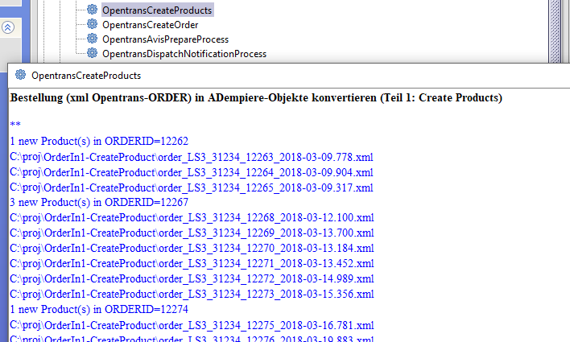

# Datenaustausch mittels openTRANS

[openTRANS](https://de.wikipedia.org/wiki/OpenTRANS) ist ein offener XML-Standard entwickelt auf Initiative des Fraunhofer IAO zur Unterstützung des elektronischen Datenaustauschs (EDI) bei Geschäftstransaktionen zwischen Handelsunternehmen.

Im konkretem Fall zeige ich anhand eines Geschäftsprozesses ([Streckengeschäft](https://de.wikipedia.org/wiki/Streckengesch%C3%A4ft)) die Nutzung von openTrans im ADempiere-Umfeld. Das folgende [BPML](https://de.wikipedia.org/wiki/Business_Process_Model_and_Notation#Version_2.0) Diagramm zeigt drei Geschäftspartner (Aktoren)

- in der mittleren [Bahn](https://de.wikipedia.org/wiki/Business_Process_Model_and_Notation#Pools_und_Swimlanes_.28Schwimmbahnen.29) unsere Firma, die ADempiere einsetzt
- unten ein Kunde, der per Internet oder Katalog Waren bei uns kauft
- oben die Firma SOE, unserer Streckengeschäftspartner der das WEB-Geschäft abwickelt. SOE ist für den Kunden nicht sichtbar. SOE kommuniziert mit uns per openTRANS.

In dem dargestellten Geschäftsfall 
- bestellt ein Kunde SOE-Produkte auf unserer Website 
- SOE bereitet die Lieferung vor
- und sendet eine openTRANS-ORDER Nachricht zu uns

## openTRANS-ORDER

Typischerweise fallen mehrere Nachrichten dieser Art täglich an. Sie werden periodisch abgeholt und müssen in das ERP-System eingespeist werden. Die anfallenden openTRANS-ORDER Nachrichten landen in einem Verzeichnis (OrderXML):
 

Dort werden sie von `CreateProductProcess` abgeholt.

Da im Streckengeschäft die Produkte bei uns nicht lagerhaltig sind, sind sie auch nicht zwangsläufig im ADempiere erfasst. Erst durch die ORDER Nachricht muss das Produkt mit all seinen Artikel-Bestandteilen angelegt werden:
- [Maßeinheiten](http://wiki.idempiere.org/de/Ma%C3%9Feinheit_%28Fenster_ID-120%29): der Kunde hat drei "Six pack" Bier geordert. Die Maßeinheit "Six pack"-P6 muss im System definiert sein.
- Preise: um die Rechnung auszustellen, werden im ADempiere die aktuellen Preise benötigt
- Steuern
- und natürlich das Produkt selber

`CreateProductProcess` kann überwacht oder im Hintergrund den ersten Teil des oben beschriebenen Workflows verrichten. Unser Kunde hat sich für den überwachten Ablauf entschieden, da damit eventuelle Störungen sofort erkennbar sind. Der zuständige Mitarbeiter startet den Prozess per Mausklick und bekommt gleich ein Feedback wie viele Objekte erstellt wurden:

Nachdem alle Produkte für den Auftrag erstellt sind, kann mit `CreateOrderProcess` der adempiere-Auftrag erstellt werden. Damit ist die Bearbeitung der openTRANS-ORDER abgeschlossen.

## Lieferavis

Der Lieferavis (in openTrans Terminologie DISPATCHNOTIFICATION), also die Ankündigung einer Lieferung hat in ADempiere kein Gegenobjekt. Am ehesten kann man DISPATCHNOTIFICATION auf einen Lieferschein abbilden.  
 
Für das Lieferavis gibt es zwei Prozesse:

- `AvisPrepareProcess` erstellt eine Kopie des XML-Avis im openTRANS 2.0 Format. Mit einer CSS-Definition kann der Nutzer die Avis Inhalte zur Kontrolle im XML-Browser lesen.
- `DispatchNotificationProcess` beinhaltet die eigentliche Transformation und erstellt zum Avis den entsprechenden ADempiere-Lieferschein, aus dem die Rechnung generiert werden kann.
 

